## 第一天：抵達名古屋

**日期**：6月6日（星期四）

- **14:00**：在桃園機場第二航廈集合，準備搭乘華航CI150航班。
- **17:10**：從桃園國際機場起飛，前往名古屋中部國際機場。
- **21:05**：抵達名古屋中部國際機場。
- **21:30**：搭乘μ-SKY機場鐵路前往名古屋市區。
- **22:20**：抵達名古屋車站，轉乘地鐵東山線前往住宿地點。
- **23:10**：抵達住宿地——千種區春岡1丁目4番21號（日向旅居）。

---

## 第二天：名古屋城與榮區探索

**日期**：6月7日（星期五）

- **09:00**：從住宿地出發，搭乘地鐵東山線前往榮區。
- **09:30**：抵達名古屋城，參觀並購買門票（¥500）。
- **11:30**：在名古屋城附近的金シャチ橫丁店享用午餐。
- **13:00**：前往金山地區，參觀電塔、綠洲21、榮地下街等景點。
- **17:00**：晚餐選擇烏龍麵或和牛，自由活動後返回住宿地。

    

        
        
與名古屋城合照

    

### ✏️ 名古屋城簡介  
名古屋城是日本三大名城之一，建於江戶時代初期，由德川家康下令建造。城堡以其巨大的金鯱（金色虎頭魚）聞名，象徵著權力與繁榮。城堡內部展示了豐富的歷史文物和建築模型，頂層還可以俯瞰名古屋市區的美景。

    

        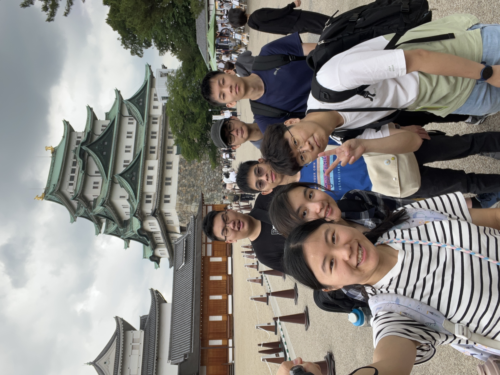
        
與名古屋城合照

    

    

        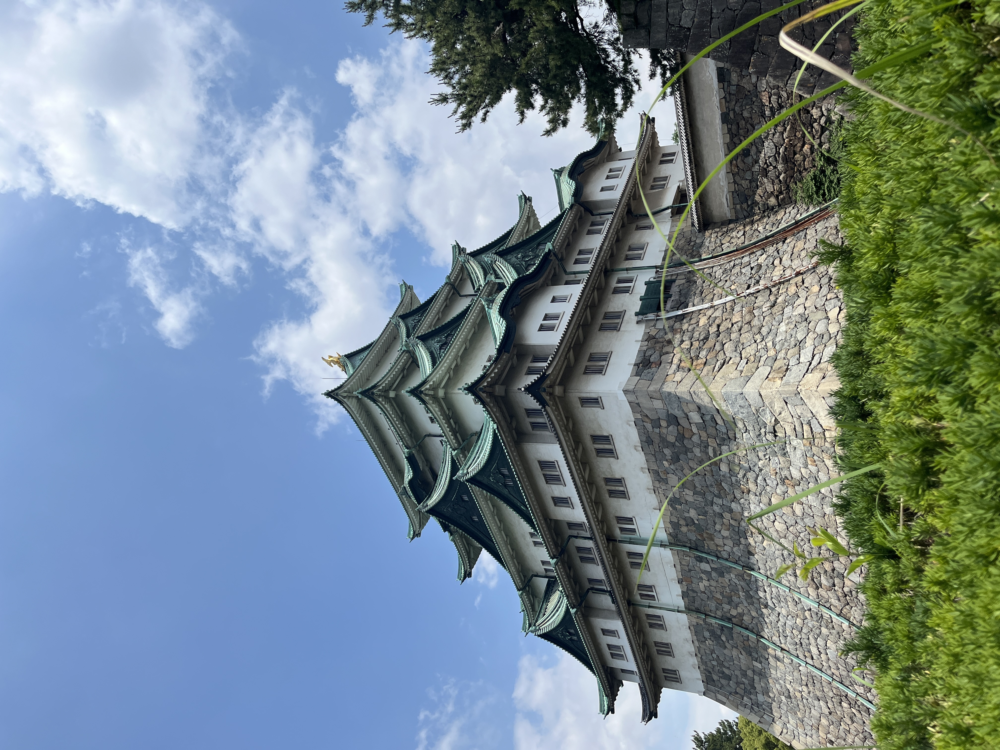
        
雄偉的名古屋城

    

    

        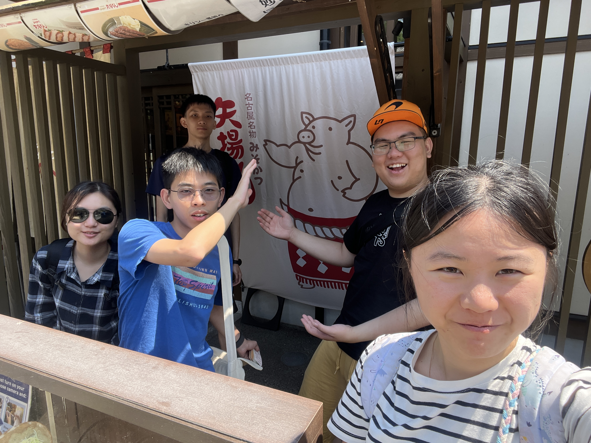
        
午餐吃有名的矢場豬排

    

    

        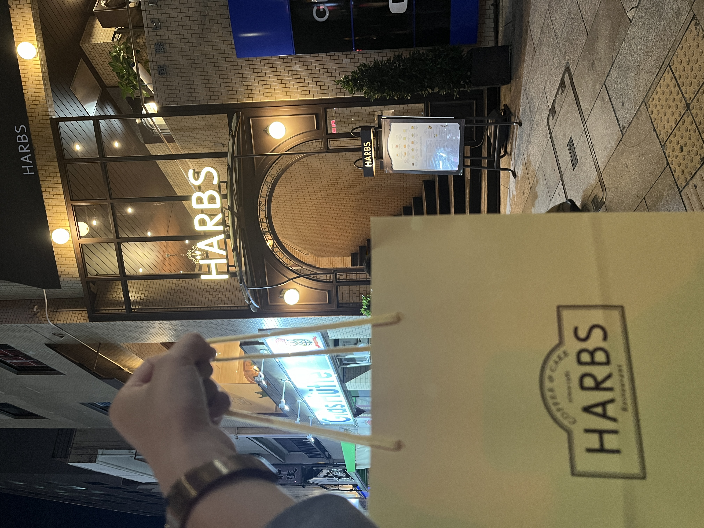
        
有名的水果千層蛋糕HARBS

    

### ✏️ 榮區（Sakae）簡介
榮區是名古屋最繁華的商業區之一，擁有眾多購物中心、餐廳和娛樂設施。著名的景點包括綠洲21（Oasis 21）、名古屋電視塔和榮地下街。綠洲21是一個現代化的建築，頂層的「水之宇宙船」是一個觀景平台，可以俯瞰整個榮區。

    

        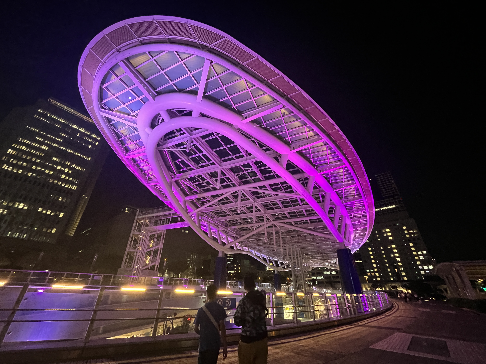
        
綠洲21

    

    

        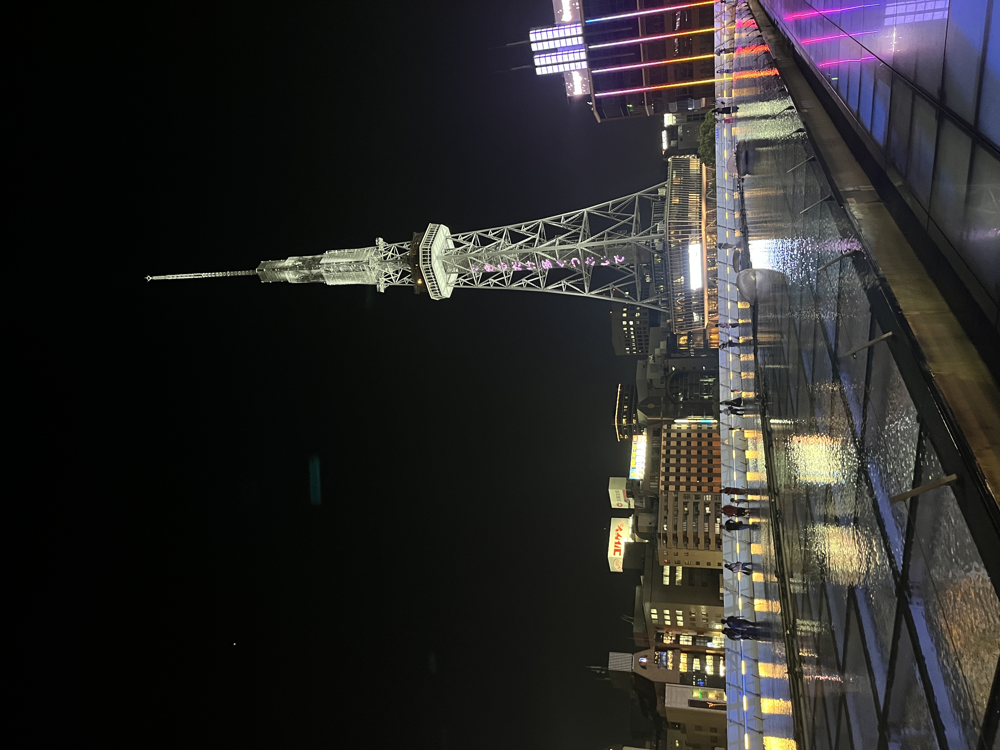
        
電塔

    

---

## 第三天：犬山城與和服體驗

**日期**：6月8日（星期六）

- **08:00**：從住宿地出發，搭乘地鐵東山線前往名古屋車站。
- **09:00**：在名古屋車站購買犬山城一日套票（¥1630）。
- **09:21**：搭乘名鐵快速特急前往犬山。
- **10:00**：抵達犬山，租借和服/浴衣（女性¥6600，男性¥4400）。
- **10:30**：參觀犬山城下町、三光稻荷神社，並在當地享用午餐。
- **15:00**：返回名古屋，自由活動後返回住宿地。

### ✏️ 犬山城簡介  
犬山城是日本現存最古老的天守閣之一，被指定為國寶。城堡位於木曾川旁，風景優美，四季皆有不同的風貌。犬山城下町保留了江戶時代的風貌，遊客可以在這裡體驗傳統的日本文化，並租借和服漫步於古色古香的街道。

    

        
        
和服與犬山城下町街景

    

    

        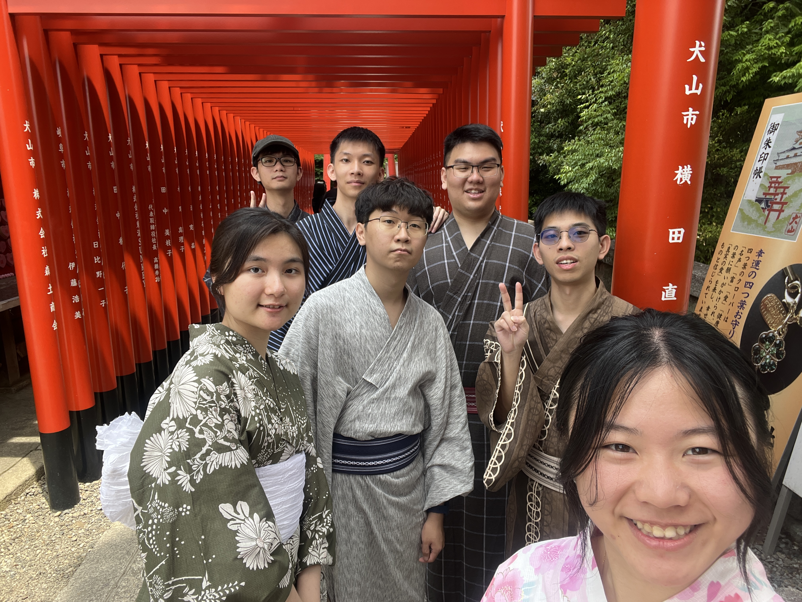
        
三光稻荷神社

    

    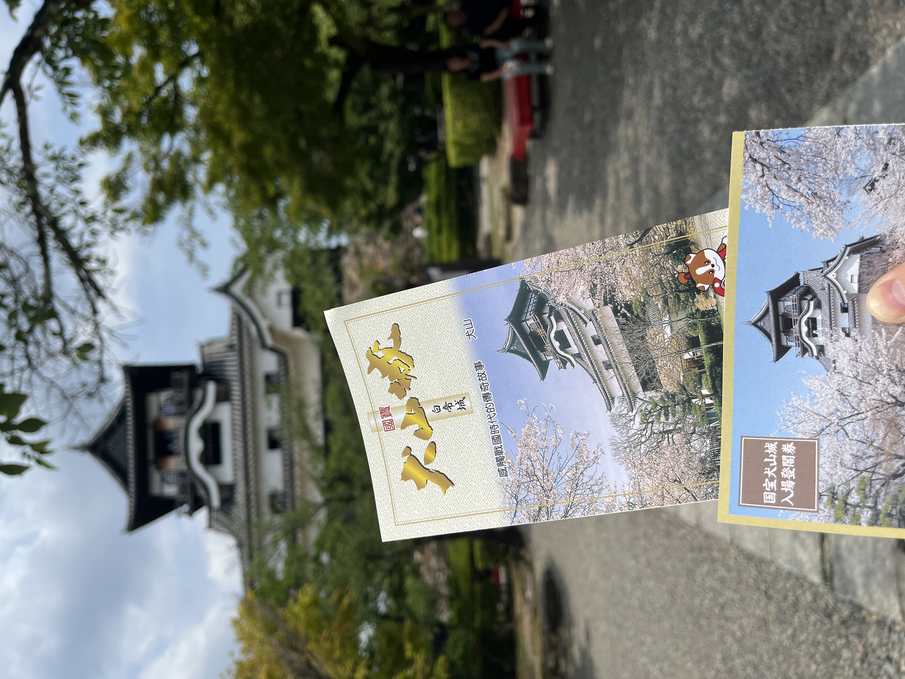
    
犬山城

---

## 第四天：大須觀音與商店街

**日期**：6月9日（星期日）

- **09:30**：從住宿地出發，搭乘地鐵東山線前往大須觀音。
- **10:00**：抵達大須觀音，參觀後前往大須商店街。
- **11:30**：在大須商店街自由活動並享用午餐。
- **16:00**：返回住宿地，自由活動。

### ✏️ 大須觀音與大須商店街簡介  
大須觀音是名古屋著名的佛教寺廟，供奉著千手觀音。寺廟周圍的大須商店街是名古屋最大的購物區之一，擁有超過1200家商店，販賣從傳統工藝品到現代時尚商品的各種商品。這裡也是美食天堂，有許多當地特色小吃和餐廳。

    

        
        
大須觀音

    

    

        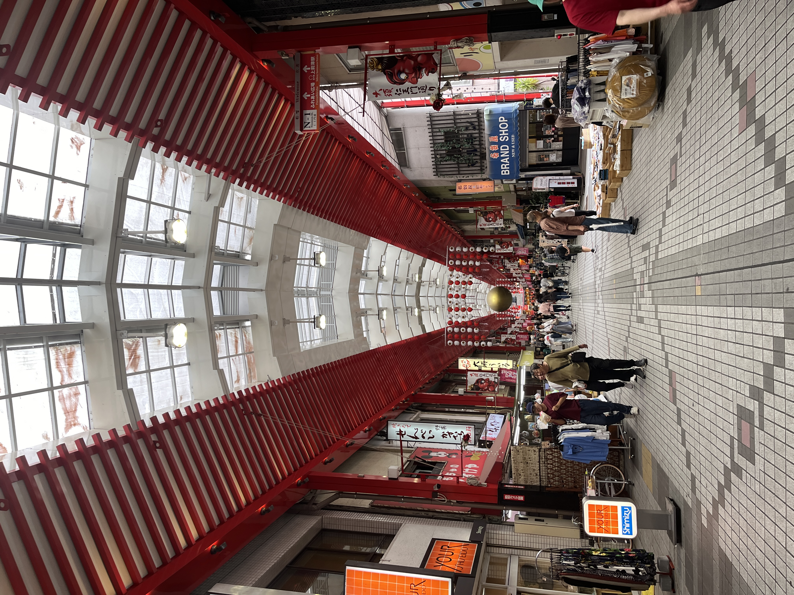
        
大須商店街

    

---

## 第五天：日本樂高樂園

**日期**：6月10日（星期一）

- **09:00**：從住宿地出發，搭乘臨海鐵路青波線前往金城埠頭。
- **10:00**：抵達日本樂高樂園，遊玩至下午。
- **15:00**：參觀磁浮列車館或返回市區。
- **17:00**：返回名古屋市區，自由活動後返回住宿地。

### ✏️ 日本樂高樂園簡介 
日本樂高樂園是亞洲第二座樂高主題樂園，適合家庭和樂高愛好者。園區內有超過40個遊樂設施和景點，分為七大主題區，包括樂高城市、忍者世界和冒險樂園等。樂園內還有用樂高積木搭建的名古屋城等日本著名地標。

### ✏️ 磁浮列車館簡介 
磁浮列車館展示了日本磁浮列車的發展歷史和技術。館內有實物大小的磁浮列車模型，遊客可以了解磁浮列車的工作原理，並體驗模擬駕駛。這裡是科技愛好者和鐵道迷的必訪之地。

    

        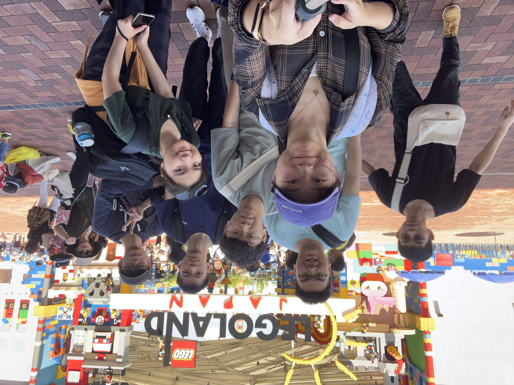
        
LegoLand 樂高樂園

    

    

        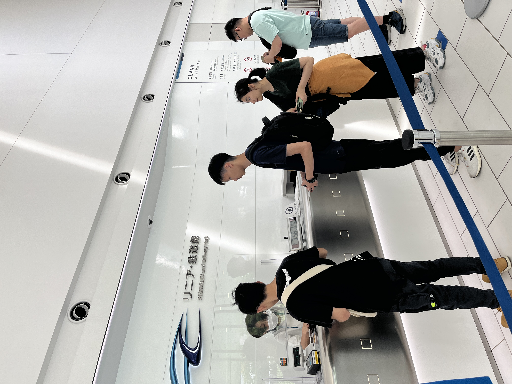
        
磁浮列車鐵道館

    

    

        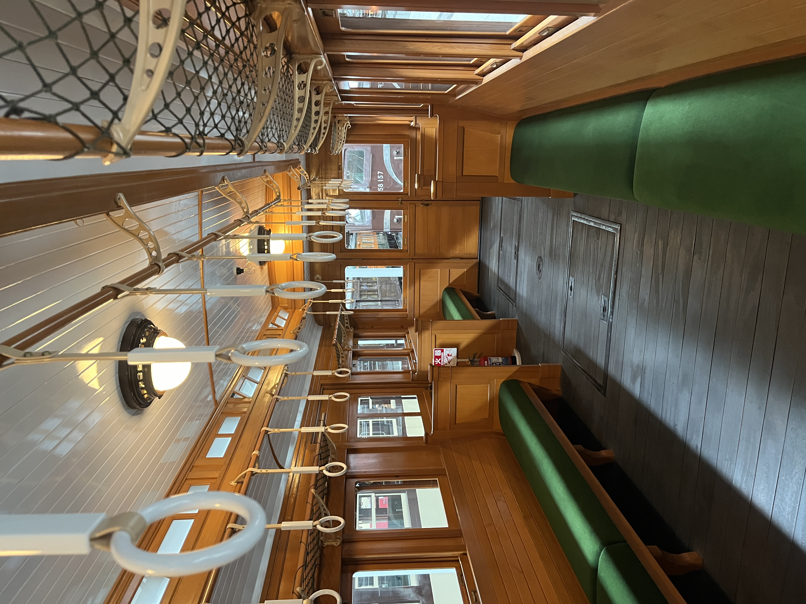
        
舊式火車內部

    

    

        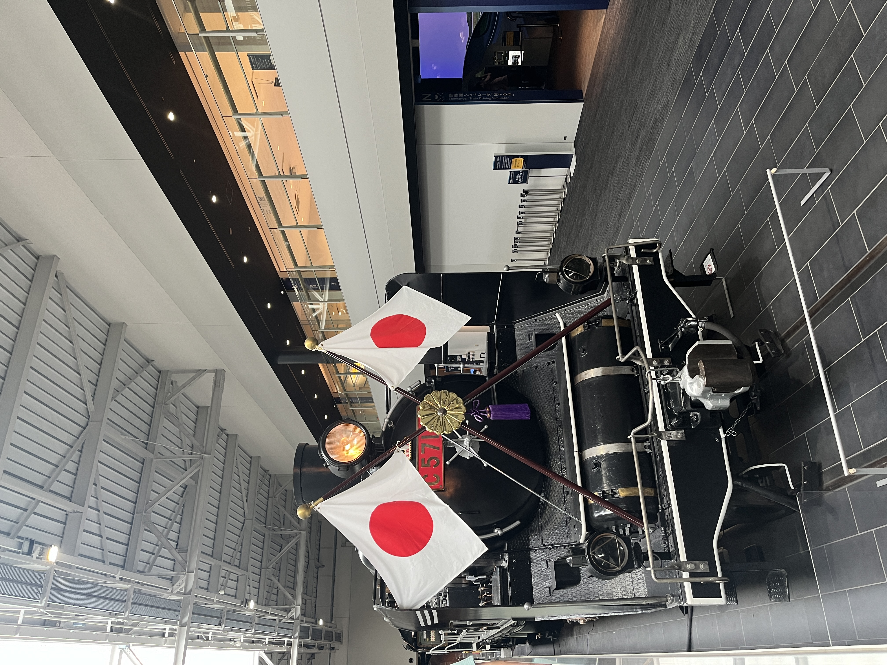
        
雄偉的傳統火車

    

---

## 第六天：熱田神宮與名古屋港水族館

**日期**：6月11日（星期二）

- **09:00**：從住宿地出發，搭乘地鐵前往熱田神宮。
- **10:00**：參觀熱田神宮及寶物館（門票¥500）。
- **11:00**：步行前往白鳥庭園（門票¥300）。
- **12:00**：午餐時間。
- **13:00**：搭乘地鐵前往名古屋港水族館（門票¥2030）。
- **16:00**：返回住宿地，自由活動。

### ✏️ 熱田神宮簡介 
熱田神宮是日本最重要的神道教神社之一，供奉著日本三大神器之一的「草薙劍」。神宮內有廣闊的森林和古老的建築，氣氛莊嚴肅穆。寶物館展示了許多與神宮歷史相關的文物和藝術品。

    

        
        
熱田神宮

    

    

        
        
熱田神宮外

    

### ✏️ 名古屋港水族館簡介 
名古屋港水族館是日本最大的水族館之一，分為南北兩館。南館以海洋生物為主，展示了從日本沿海到南極的各種海洋生物；北館則以鯨鯊和海豚表演聞名。水族館還有一個巨大的水槽，展示了鯨鯊和蝠鱝等大型海洋生物。

    

        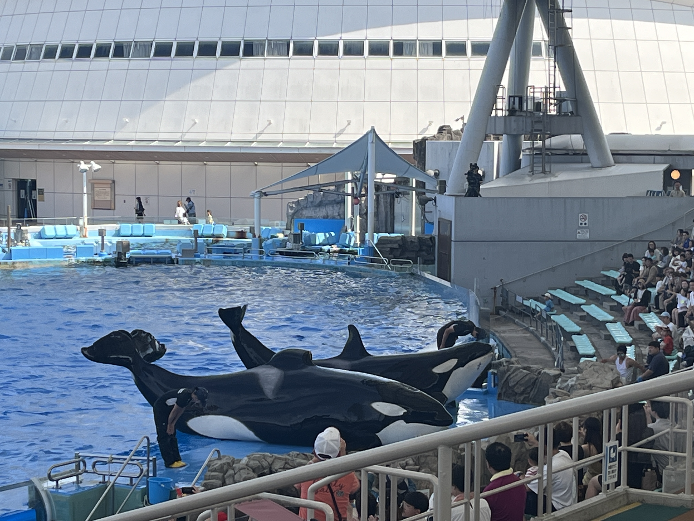
        
名古屋水族館

    

    

        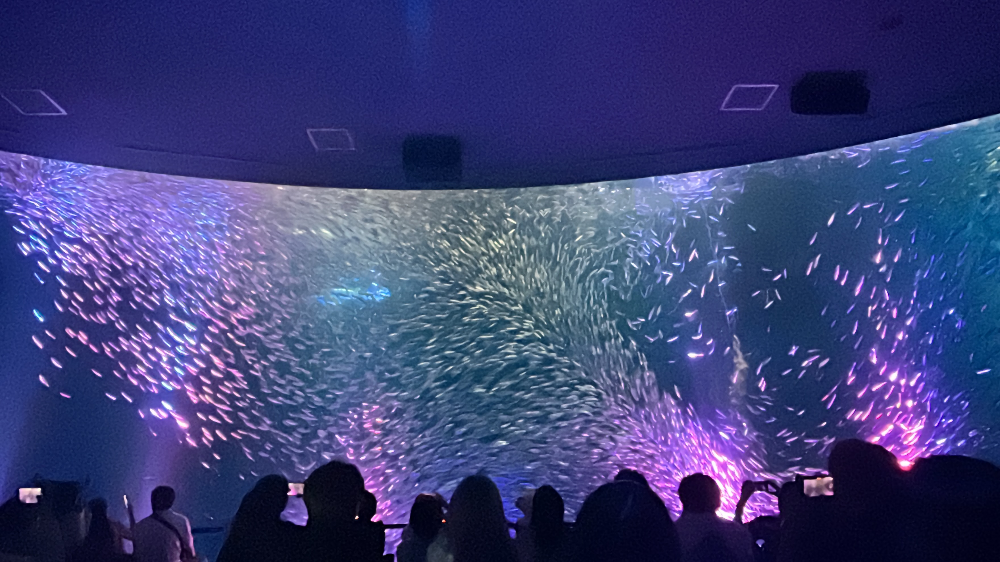
        
沙丁魚光影show

    

---

## 第七天：返回台灣

**日期**：6月12日（星期三）

- **05:30**：從住宿地出發，搭乘機場鐵路前往名古屋中部國際機場。
- **07:30**：辦理登機手續。
- **09:55**：搭乘華航CI151航班返回台灣。
- **11:55**：抵達桃園國際機場，結束旅程。

    

        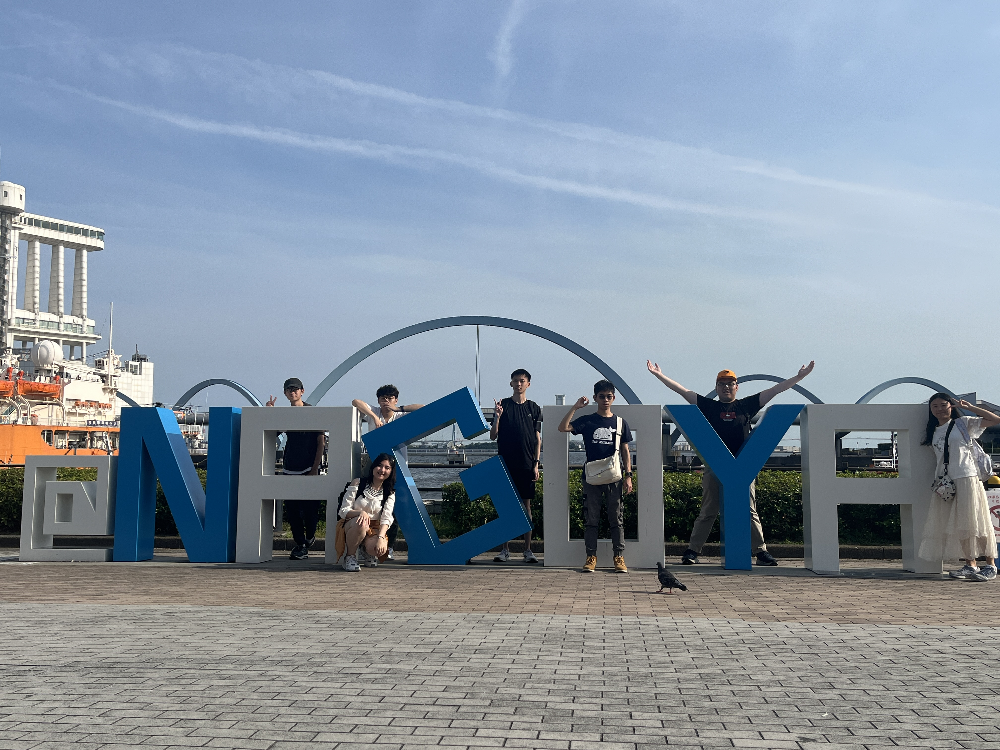
        
  第二個 NAGOYA !

    

    

        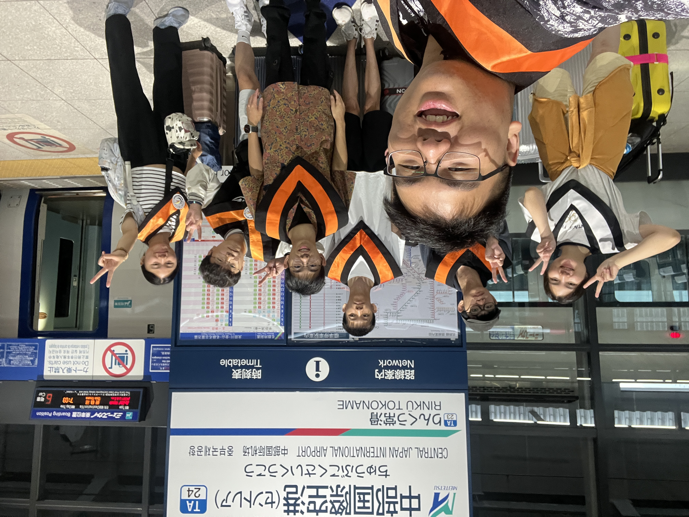
        
Happy graduation trip !

    

