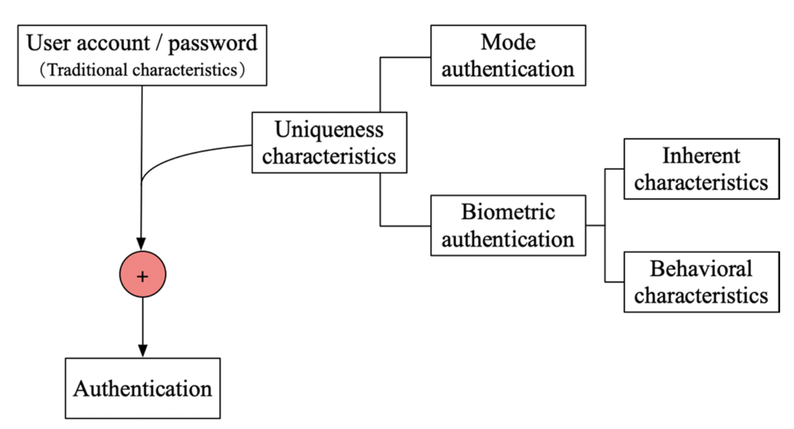
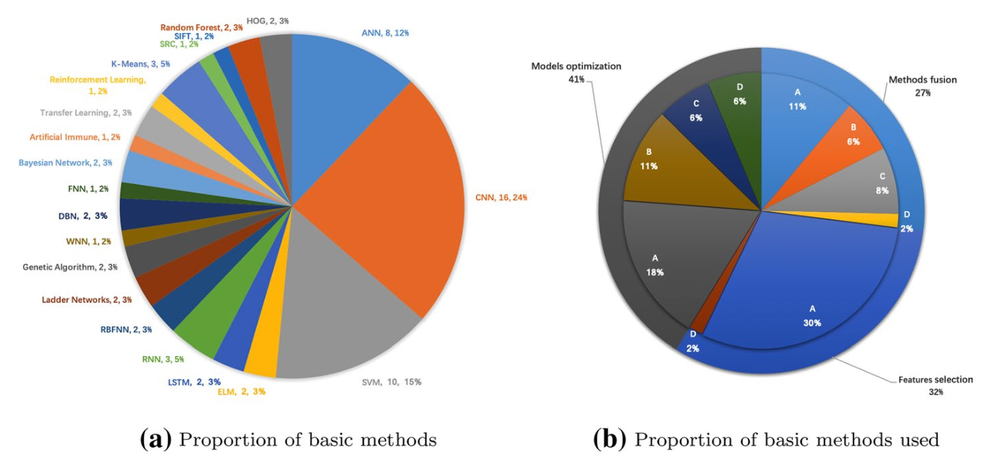
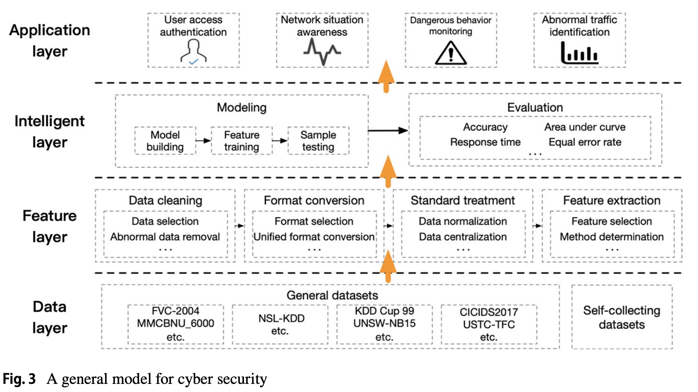
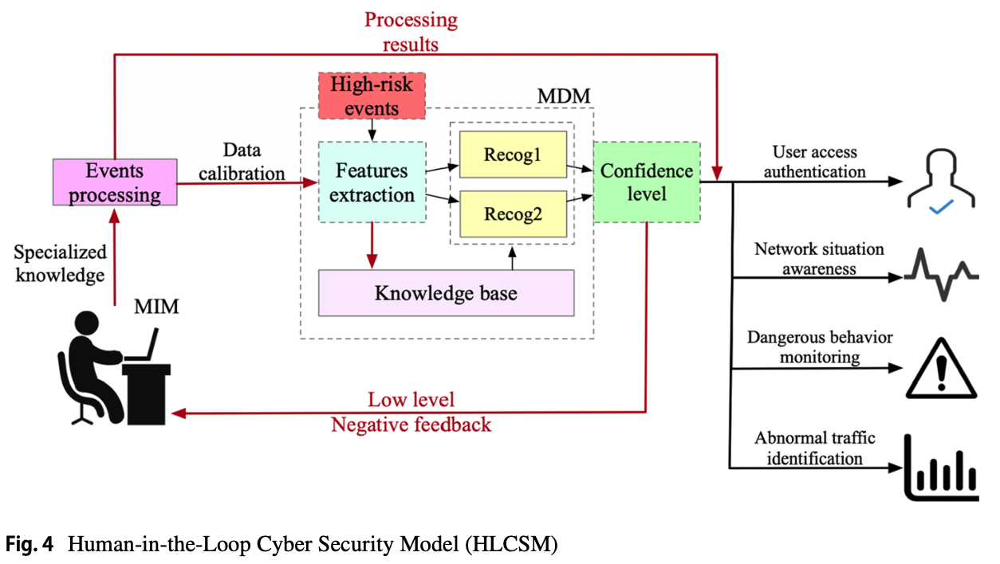
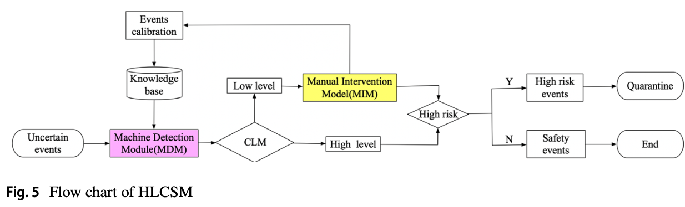

# 1. Abstract

→ AI在 ___ 的應用。

1. 用戶訪問認證 user access authentication
2. 網絡情況感知 network situation awareness
3. 危險行為監控 dangerous behavior monitoring
4. 異常流量識別中 abnormal traffic identification

---

# **2. Potential applications of AI in cyber security applications**

## 2-1.  User Access Authentication

a) Mode authentication

Based on the shortcomings of one-time authentication, **multi-authentication** technology has been considered.

| 作者 | 研究內容 |
| --- | --- |
| Shoufan (2017a) | Random Forest |
| Korkmaz (2016)  | 在密碼驗證系統中進行密碼匹配，還通過神經網絡訓練用戶的鍵盤使用風格，包括打字速度、打字風格、按鍵組合等。 |
| Wang和Fang (2019)  | 設計了一個具有全局和局部功能的核函數(kernel function)，構建了基於支持向量回歸（SVR-Support Vector Regression）的移動通訊網絡安全驗證機制。 |
| Chang等 (2016)  | 使用一類支持向量機（One-Class SVM）實現keystroke動態模式識別。 |
| Lu等 (2020)  | 使用CNN、強化學習和遷移學習構建了一種物理驗證方案，抵抗惡意邊緣攻擊。 |

b) Biometric authentication

- Fingerprint Recognition:

| 作者 | 研究內容 |
| --- | --- |
| Singh等（2017b） | 基於 sparse proximity 的指紋識別方法。 |
| Hariyanto等（2015b） | 基於 Artificial Neural Network 的指紋特徵點匹配算法。 |
| Saeed等（2018a） | 基於修正 Histogram of Oriented Gradients 描述子的指紋分類方法。 |
| Bakhshi和Veisi（2019a） | 基於 CNN 的 end-to-end 識別模型。 |

- Face Recognition:

| 作者 | 研究內容 |
| --- | --- |
| Ding和Tao（2018） | 基於 CNN 的框架，改進了 triple-state loss function。 |
| Salyut和Kurnaz（2018b） | 基於局部二值模式的 ANN，用於實現輪廓人臉識別(contour face recognition)。 |
| Verma等（2019） | 面部表情識別中使用了混合遺傳特徵學習網絡(hybrid genetic feature learning network)。 |

- Iris Recognition:

| 作者 | 研究內容 |
| --- | --- |
| Păvăloi和Niţă（2018a） | 使用了一些距離度量和尺度不變特徵變換（SIFT-Scale Invariant Feature Transform）。 |
| Zhang等（2019） | 使用 Dilated convolution (膨脹) 。 |
| Gangwar和Joshi（2016a） | 使用 Deep Convolutional Neural Network 。 |

- Finger Vein Recognition:

Yang等（2019）使用多層ELM

Liu等（2017）使用多層CNN

Hong等（2017）使用全卷積神經網絡（FCN）

Zeng等（2020）使用轉移學習來實現識別

- Voice Recognition:

| 作者 | 研究內容 |
| --- | --- |
| Amberkar等（2018b） | 研究了RNNs(Recurrent Neural Networks)在語音識別領域的重要作用。 |
| Parthasarathy和Busso（2019b） | 引入了梯形網絡(ladder networks)。 |
| Han和Wang（2019a） | 提出了一種使用 Deep Belief Networks 和近端SVM的語音識別新方法。 |

- Gait Recognition:

| 作者 | 研究內容 |
| --- | --- |
| Uddin等（2017a） | 從深度輪廓(depth silhouettes)中提取特徵，並使用CNN進行訓練和識別。 |
| Uddin等（2017a） | 結合RNN、CNN和徑向基函數神經網絡（RBFNN-Radial Basis Function Neural Network）以消除視角對步態識別的影響。 |

## 2-2. Network Situation Awareness

In the process of network construction, designers may not find vulnerabilities and insecurities in the network topology.

| 作者 | 研究內容 |
| --- | --- |
| Young Park 等（2016b） | Multi-entity Bayesian Networks (MEBN) 在態勢感知中的應用，採用人機協作的理念。 |
| Li 和 Li（2017a） | 模糊神經網絡（FNN）在態勢評估中的應用，結合機器學習方法與模糊理論(fuzzy theory)。 |
| Yunhu Jin 等（2016b） | 基於隨機森林的態勢評估模型，每棵樹使用獨立樣本並共同參與分類。 |
| Li 等（2018b） | 基於時空網絡態勢感知機制的信息融合模型，使用RBFNN進行態勢預測。 |
| Yang 等（2019） | 基於CNN的新安全指數計算方法，用於評估網絡態勢。 |
| Shi 等（2017） | 基於免疫系統和灰色預測理論的安全態勢感知模型。 |
| Dongmei 和 Jinxing（2018） | 使用基於粒子群算法的小波神經網絡（WNN-Wavelet Neural Network）實現網絡態勢感知，並設計減少數據屬性的新算法。 |
| Naderpour 等（2014） | 使用動態貝葉斯網絡(dynamic Bayesian network)作為態勢評估組件，並使用模糊風險估計方法生成結果，體現人機協作的理念。 |
| Bao 等（2019b） | 針對大數據和AI背景下的信息安全態勢感知系統設計進行優化，包括系統硬件配置、AI同步運行機制、信息安全態勢推理算法和系統軟件結構的改進，並增加基於安全特徵參數的對比修復步驟。 |

## 2-3. Dangerous Behavior Monitoring

隨著數據量的快速增長和互聯網接入的增加，hackers 致力於尋找網絡的“lethal points”，並隨時發動攻擊。

研究人員開始在原有的入侵檢測系統基礎上進行改進和創新，以使當前的入侵檢測系統儘可能具備可擴展性。

### a. 主要研究案例

| 研究名稱 | 作者 | 研究內容 |
| --- | --- | --- |
| 分佈式大規模網絡異常行為檢測方法 | Marir et al. (2018) | 結合深度特徵提取和多層集成支持向量機 (SVM)，使用分佈式深度信念網絡 (DBN) 降維，檢測大規模網絡流量數據集中的異常行為。 |
| 基於AI的超參數優化網絡入侵檢測系統 | Kanimozhi 和 Jacob (2019b) | 使用人工神經網絡 (ANN) 技術檢測僵屍網絡攻擊，可部署於多台機器上。 |
| 混合入侵檢測系統 | Aljamal et al. (2019b) | 在雲計算環境中，融合K-Means聚類算法和SVM分類算法。 |
| 基於管理程序的異常檢測系統 | Pandeeswari 和 Kumar (2016) | 使用基於模糊C均值算法的神經網絡，在雲計算環境下，該系統在低頻攻擊下表現良好。 |

### b. 針對單一危險行為的系統

| 研究名稱 | 作者 | 研究內容 |
| --- | --- | --- |
| DDoS(Distributed Denial of Service)檢測框架 | Jyothi et al. (2016b) | 使用K-Means進行行為聚類，使用SVM進行分類，實驗效果良好。 |
| 基於深度學習的DDoS檢測方法 | Yuan et al. (2017a) | 系統由CNN、RNN和全連接層組成。 |
| 高速度、高流量網絡系統檢測系統 | Hsieh 和 Chan (2016a) | 系統分為五部分：數據收集器、Hadoop-HPFS、格式轉換器、數據處理設備和神經網絡檢測模塊。神經網絡可以有效識別數據包特徵。 |

### c. 5G時代的異常檢測研究

**→ 自適應深度學習的5G網絡異常檢測系統**

- **作者**：Fernández Maimó et al. (2018)
- **方法**：框架中使用了兩層深度學習模型。一層使用深度神經網絡 (DNN) 進行網絡流量聚合檢測以快速搜尋異常跡象；另一層基於時間線和相關症狀的關係來識別網絡異常，並在發現異常後直接與監控和診斷模塊通信。使用長短期記憶網絡 (LSTM-Long Short-Term Memory) 處理時間序列數據。

## 2-4. Abnormal Traffic Identification

Hackers會故意向網路結構注入大量非法數據，使網路節點和 link 無法承受而引發事故，無法為用戶提供服務，甚至導致資訊遺失等嚴重問題。

如何透過網路流量分析為網路態勢感知提供重要依據，及時發現網路空間高風險行為並採取有效措施，對於增強網路回應能力、維持整體網路安全具有重要意義。

| **作者** | **研究重點** |
| --- | --- |
| Ahmed等 (2015a) | 將異常流量檢測方法分為四類：分類(classification)、統計(statistics)、聚類(clustering)和信息理論(information theory)。 |
| Aljurayban 和 Emam (2015a) | 提出了一種可在不同雲層級整合並捕獲流量後發送至人工神經網絡（ANN）的入侵檢測系統框架。 |
| Zhang等 (2019) | 提出了一種基於深度學習的並行交叉卷積神經網絡（PCCN），用於在多類不平衡網絡中實現流量異常檢測。 |
| Zeng等 (2019) | 提出了一種基於深度學習的端到端網絡流量識別框架，使用卷積神經網絡（CNN）提取特徵，長短期記憶網絡（LSTM）記錄時間特徵。 |
| Kong等 (2018a, 2017b, 2018b) | 將異常流量識別與人工智能結合，比較了K-means（無監督）和支持向量機（SVM，監督）在異常流量中的性能，並建立了基於SVM的系統來識別和分類多種攻擊流量，還提出使用並行計算加速模型訓練。 |

## 2. Summary

→ 大多數提出的方法是通過對人工智慧基本方法的轉化來實現的。

其中，24%的方法使用了卷積神經網絡（CNN），15%的方法使用了支持向量機（SVM），12%的方法使用了人工神經網絡（ANN）

圖3展示了一個總結大多數網絡安全研究思路的模型。

該模型通過四個主要步驟來解決安全問題：

1. **數據層**：通用數據集和自收集數據集。
2. **特徵層**：有效的特徵提取是準確確定安全問題的重要因素。
3. **智能層**：這一層分為建模和評估兩步驟。
4. **應用層**：建模完成後，模型會提供解決方案或結合具體場景進行部署。

---

# 3. Limitations of AI-based Approaches

AI模型在網絡安全領域表現不佳的因素。

## 3.1 Interference of Confusing Data

→ 干擾數據能在一個像素上欺騙AI。

| **作者** | **研究內容** |
| --- | --- |
| Su等（2019） | 只改變圖像中的一個像素就能導致神經網絡的錯誤分類。 |
| Kolosnjaji等（2018a） | 緊密修改了惡意樣本軟件中的幾個字節，導致神經網絡分類錯誤。 |
| Hu和Tan（2017） | 使用生成對抗網絡（GAN）獲取惡意軟件樣本，能夠繞過檢測系統。 |

## 3.2 Maliciously Modified Model

AI模型的實現是一個程序，其中可能存在一些漏洞(可能來自特定的高級語言、硬件特定問題或嵌入在模型中的後門)。

→ Gu等（2017b）在神經網絡中實現了後門，這使得神經網絡在特定攻擊者樣本中的表現非常差。這些缺陷也從側面反映出程序給出的答案不一定是準確的。

## 3.3 Lack of Transparency in AI Decision-Making Process

面對未知事件時，AI模型能否保持如此高的精度仍需驗證，當AI模型的決策結果受到質疑時，很難解釋其決策過程，這導致對結果的懷疑，這種懷疑不利於快速判斷網絡情況，甚至可能造成不可逆轉的後果。

## 3.4 High Data Requirements

AI模型基本上需要大量數據來完成訓練。

---

# **4 Conceptual human‐in‐the‐loop cyber security model**

## **4.1 The development of human‐in‐the‐loop(人機協作的發展)**

人機協作 → 結合人類智慧和機器智能可以有效提高安全性，在領域中不斷進行的創新和探索。

## **4.2 Model design of cyber security based on human‐in‐the‐loop**

論文提出了一種基於人機協作的新模型，稱為人機協作網路安全模型（HLCSM-Human-in-the-Loop Cyber Security Model）。

HLCSM主要分為兩個子模塊：機器檢測模塊（MDM-Machine detection module）和人工干預模塊（MIM-Manual intervention module）。

這兩個子模塊相互作用，以預防和檢測網路不確定事件。

### **4.2.1 Machine detection module (MDM)**

在HLCSM中，MDM扮演“主導角色”。

- 當高風險事件發生時，MDM會對數據進行預處理(preprocess)
    
    → 這可能包括數據清理、數據正規化等操作。
    
- 當數據正規後從數據中提取特徵非常重要。
    
    → 數據包含定位事件類型的關鍵信息和其他相關性較小的信息。隨著數據量的增加，需要選擇特徵並降維，以便快速完成任務。
    
- 在數據特徵提取後，它們被送到識別方法(Recog…)
    
    → 這是MDM的關鍵環節。只有當所選方法滿足要求時，識別準確性才會更高。
    
- 給出識別結果後，運行結果將由信心水平模塊（CLM-confidence level module）判斷
    
    → 其值將決定最終結果是否基於MDM。
    

在MDM中，使用了兩種識別方法，可以增加規避難度並進一步提高結果的準確性。

兩種產生的結果都將由CLM處理。

### **4.2.2 Manual intervention module (MIM)**

在HLCSM中，MIM扮演“輔助角色”。

當MDM的結果不令人滿意時，處理能力應轉交給MIM。

安全專家收到信息反饋後，將根據經驗知識處理事件。

最終判定事件是否安全的結果將由安全專家直接給出，不再由MDM干預。

### **4.2.3 Confidence level module (CLM)**

→ 連接MDM和MIM並實現兩個模塊的協作。

CLM的主要功能是決定是否需要調用MIM來完成事件處理。

當MDM的識別方法給出兩個處理結果時，CLM整合結果並給出信心水平。

- 當信心水平高時，最終結果將由MDM直接給出，這不僅可以節省人力，還可以減少識別時間，滿足網路事件處理的要求。
- 當信心水平低時，反饋將到達MIM並由專家處理，以最小化錯誤。

結果的可信度不高，將不被視為最終判斷結果。

## **4.3 Flow chart of HLCSM**

從流程圖中可以看出，事件判斷後應進行一些後續工作，以構成一個完整的網路事件防禦模型。

- 如果是高風險事件，應採取隔離等措施。
- 如果是安全事件，操作應結束。

在這個模型中，無需使用大量的安全專家，因為主要工作由MDM完成 → 減少人員配置和開支成本

擴展知識庫 → MDM可以處理更多的事件類型。

為了實現人機協作，CLM承擔“翻譯”責任，扮演人機界面的角色。

## **4.4 Comparison**

更直觀地表達本論文模型與通用模型之間的差異:

- **擴展性(Scalability)**：在MDM中，使用兩種識別方法互補。選擇具體的技術方法或擴展知識庫、識別方法的數量。
- **可維護性(Maintainability)**：HLCSM增加了兩個新模塊（MIM和CLM），需要實現model之間的協作
- **封閉性(Closedness)**：HLCSM在設計中融入了閉環的概念，將人機高度整合作為最終目標。
- **集成性(Integration)**：將網路安全問題的處理分為四個模塊，這在MDM中有所體現。
- **參與性(Participatory)**：HLCSM的主要思想是人機協作，因此安全專家可以參與決策。
- **可解釋性(Interpretability)**：CLM是AI和安全專家之間的重要橋樑，可以介入低信心水平的結果，解決AI可解釋性差的問題。
- **可靠性(Reliability)**：實驗結果由兩種識別方法給出，並由安全專家處理。與通用模型相比，模型的可靠性顯著提高。
- **複雜性(Complexity)**：通用模型的處理僅涵蓋在MDM中，這表明HLCSM的複雜性更高。
- **安全性(Security)**：兩種模型都具有安全特性，但使用HLCSM將進一步減少數據偽造等因素的干擾，因此安全性得到提高。
- **可部署性(Deployability)**：由於HLCSM的系統規模較大，部署難度更高。

# **5. Conclusion**

論文回顧了集中在四個網路安全領域的AI應用文章，即用戶訪問認證、網路態勢感知、危險行為監測和異常流量識別。

除了識别研究挑戰和機會之外，本文還強調了人機協作的重要性、了解如何利用這個模型。