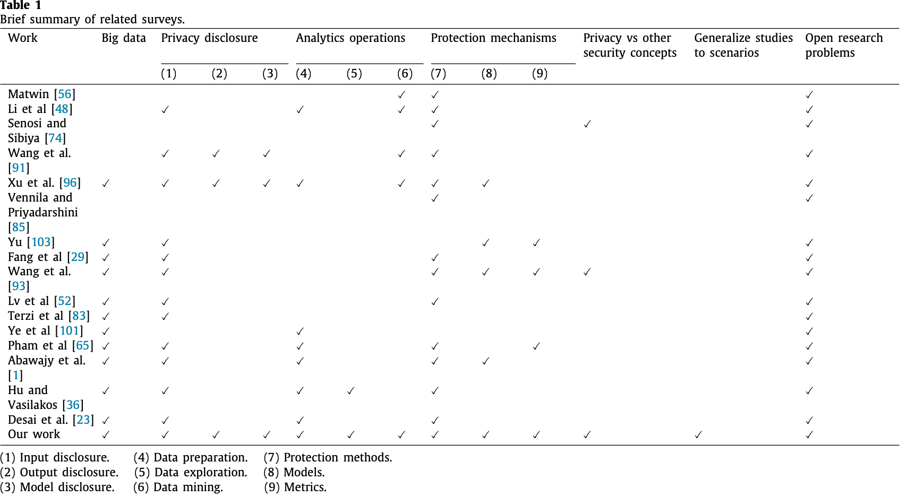
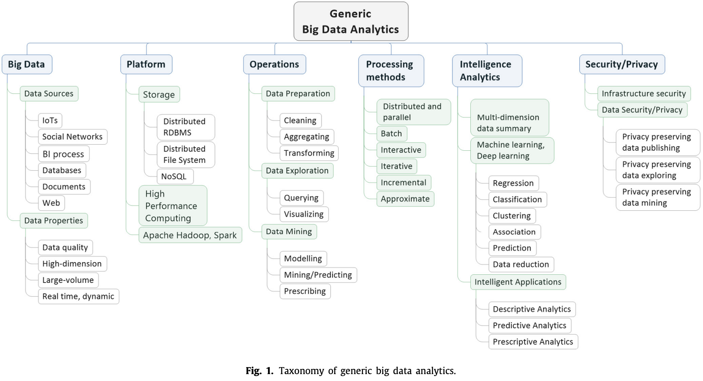
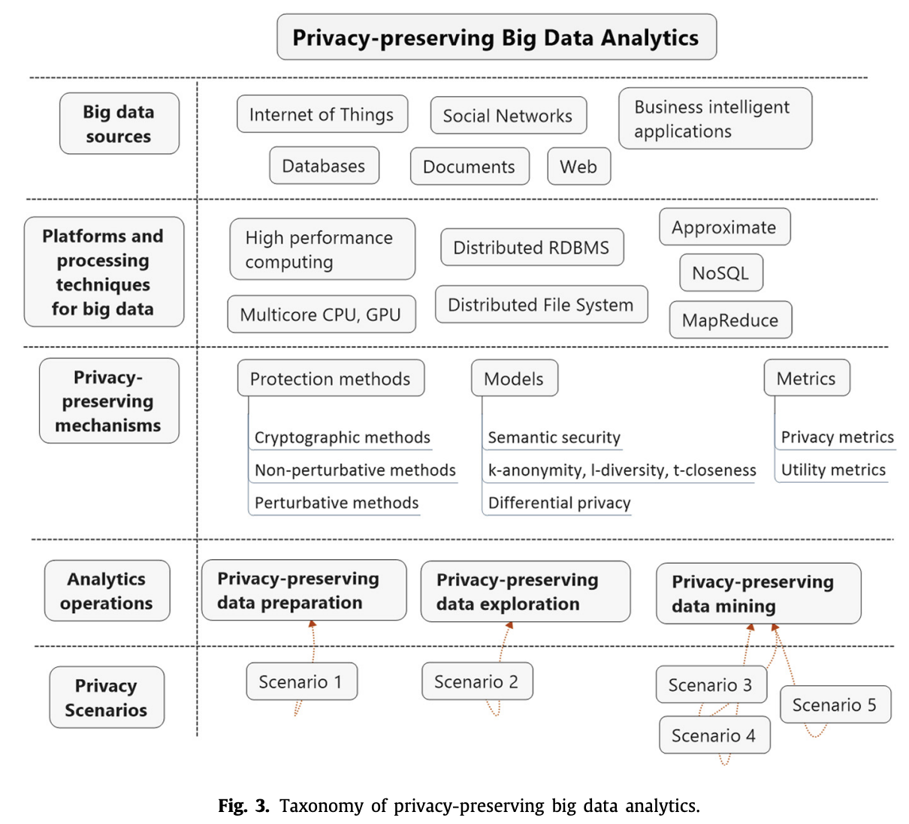

# Abstract

→ 這份調查可以作為開發現代隱私保護技術的良好參考來源，以應對實踐中遇到的各種隱私相關情景。

# 1. Introduction

## 1.1. Motivation

How to preserve privacy in original input data as well as in result
output patterns derived from data analytics is of fundamental
importance, especially in the big data era.

## 1.2. Related survey articles

1. **歷史調查與技術分類**：
    - 2008年，Aggarwal和Yu將隱私保護數據挖掘的主題組織成由密碼學、數據庫和統計披露控制社區獨立探索的方式，涵蓋了隨機化、匿名化和分佈式數據挖掘的加密方法。
2. **近期評論**：

| Vennila和Priyadarshini | 使用MapReduce在雲端進行全球記錄匿名化。 |
| --- | --- |
| Yu等人 | 回顧了隱私框架的數學模型和指標。 |
| Xu等人 | 基於用戶角色的方法總結隱私相關問題和對策。 |

---

---

# 2. Overview of big data analytics

1. **大數據的特性**：
    - 大數據具有大量、多樣性和高速的特性，傳統系統平台和數據分析方法無法應對。
    - 硬體平台（如高性能計算集群、多核心CPU、圖形處理單元）及軟體框架（如Hadoop、Spark）被開發來處理大數據分析操作的高計算複雜性。
2. **分類法**：以有效執行基本數據分析操作並提供智能分析服務，同時考慮大數據的安全和隱私。
3. **大數據來源和特性**：大數據主要來自數位化生成的應用和技術，如社交媒體和物聯網（IoT）。
4. **專用平台和處理機制**：如分佈式關係型數據庫管理系統（RDBMS）、分佈式文件系統（DFS）和NoSQL。
5. **數據分析過程**：
    - 數據分析是一整套活動，涵蓋數據的準備、探索、建模和挖掘，目的是為描述性、預測性和規範性智能分析應用（如監控系統）提取有意義的見解。
    - 機器學習可以用來解決大數據分析中的學習問題，包括從大量數據中提取高層次的複雜模式。
6. **隱私考量**：
    - 大數據來自於各種應用來源，如社交媒體和智能電表，可能包含個人用戶的私人信息。
    - 這些敏感信息可能以數據輸入的明確形式或數據輸出的隱含形式出現，後者在數據分析過程後顯現。
    - 雖然數據分析在決策中有用，但它可能導致嚴重的隱私問題。因此，基礎設施安全和數據安全/隱私已成為除了分析效用之外的重要考量。

---

# 3. Generic privacy-preserving mechanisms

## 3.1. Protection methods

分為：

1. cryptographic methods → guarantee privacy by means of encryption
schemes and protocols.
2. non-perturbation（非擾動） and perturbation → preserve privacy by
anonymization and perturbation.

### 3.1.1. Cryptographic methods

採用安全多方計算（SMC-Secure Multi-party Computation），該方法利用某些形式的同態加密（HE）方案來實現。

SMC 可以在以下情況下使用：

1. 功能已知
2. 計算分佈在多個數據擁有者之間
3. 每個站點有隱私需求

優點：保證“完美”隱私

缺點：可擴展性和實施效率低

### 3.1.2. Non-perturbative methods

標識符（ID）、準標識符（QID）、敏感屬性（SA）和非敏感屬性（NSA）

### 3.1.3. Perturbative methods

通過擾亂原始數據值來保護隱私，使得從擾亂數據計算得到的統計訊息與原始數據的統計訊息相似。

1. 輸入擾動：發布擾亂數據
2. 輸出擾動：對查詢答案/輸出添加噪聲

優點：方法相對簡單高效，不需了解其他記錄的分佈

缺點：但離群值容易受到攻擊，且擾動後的記錄不對應於真實的記錄擁有者，這可能影響數據的真實性。

## 3.2. Models

隱私保護方法的models

### 3.2.1. k-anonymity, l-diversity, t-closeness

- **k-**anonymity：用於抵抗記錄鏈接攻擊(record linkage attacks)，通過將敏感訊息隱藏在與相同QID的k-1個假記錄中，使得對手難以識別真實記錄。
- **l-**diversity：要求每個QID組中的敏感屬性有至少l個不同的值，以防止屬性鏈接攻擊(attribute linkage attacks)，但在SA整體分佈不均勻時存在限制。
- **t-**closeness：要求任何QID組中的SA分佈接近整體數據集中的分佈，以解決l-diversity的限制問題。

### 3.2.2. ϵ-Differential privacy

→ 基於擾動方法的另一種隱私模型。其目的是對相鄰數據集上函數f的計算結果的差異進行遮蔽，以防止釋放的聚合結果過多地揭示有關任何單個數據項的資訊。

優點：

1. 能夠抵抗⼤部分的隱私攻擊，包括連動攻擊。
2. 可以提供可證明的隱私保證，並基於機率統計模型定量分析隱私外洩的⾵險。

缺點：若數據是相關的（例如時間序列數據），應⽤差分隱私就很難保證效⽤。

## 3.3. Metrics（指標）

### 3.3.1. Privacy metrics

四個常見特徵(分類)：

1. adversary models
2. data sources
3. input for computation of metrics
4. output measures.

→ 這些指標描述了對手的目標和能力，以及他們如何獲取數據。

### 3.3.2. Utility metrics

效⽤指標⽤於量化受保護資料對於取得資料分析⽬的的有⽤性

1. 通⽤⽬的(general purposes)：資訊遺失度量通常⽤於量化原始資料和轉換資料之間的相似性。
2. 特定⽬的(specific purposes)：將經過淨化的資料⽤作分析任務的輸⼊，然後評估結果的品質（主要透過準確性或錯誤率）並與結果進⾏⽐較原始資料的情況。

---

# 4. Privacy-preserving big data analytics taxonomy

→ 提出一個基於情境的新型隱私保護大數據分析分類法。

## 4.1. Motivating privacy-related scenarios

1. ‘‘data owners’’：who own the original data
2. ‘‘data holders’’ ：who collect the data from the data owners
3. ‘‘data consumers’’：who carry out data analytics

### 情境 1： Privacy-preserving big social network data publishing

- 數據持有者：收集數據並發布給數據消費者。
- 風險：身份泄露、鏈接泄露和內容泄露。
- 例子：Facebook分享用戶數據給研究人員，但不暴露用戶身份或隱私。

### 情境 2：Secure Private Outsourced Data Search

- 數據所有者：將加密數據外包給不受信任的數據持有者。
- 問題：保持數據和搜索關鍵字private。
- 例子：個人將加密數據存儲在雲服務（如Dropbox, Google Drive），確保搜索過程中的數據保密。

### 情境 3：Privacy-preserving learning over outsourced data

- 數據持有者：提供存儲和計算服務，同時是數據消費者。
- 問題：確保數據所有者的private data不暴露。
- 例子：公司使用雲機器學習服務（如Microsoft Azure），確保業務數據對公共服務保密。

### 情境 4：Privacy-preserving collaborative learning with
secure aggregation

- 多個數據所有者：協同構建共享的學習模型。
- 問題：在jointly learning process中保護各自數據。
- 例子：移動用戶使用Google文本消息應用，安全地維護其private data，同時貢獻於共享模型。

### 情境 5：隱私保護的模型評估

- 數據持有者：提供學習服務。
- 問題：確保數據持有者無法了解原始數據及其預測結果。
- 例子：個人使用雲學習服務（如Google Cloud Machine Learning, Azure Machine Learning Service），保持數據和結果private。

## 4.2. Proposed taxonomy

→ 提出一種新的隱私保護大數據分析分類法

### 大數據分析挑戰

- **高維度**、**大規模**、**高速**和**多樣性**是大數據分析的特徵，對現有的隱私保護技術提出挑戰。
- 在[24]中，作者分析了大數據對現有匿名化實踐的影響，特別是對k-anonymity模型的影響，指出大數據中任何屬性都可能成為QID，這會導致“維度災難(curse of dimensionality)”，即在處理這些QID時會丟失大量information。
- 他們提出了適應當前k-anonymity算法的替代方案，使其能夠在大數據環境中對結構化數據仍然有效，但未考慮半結構化(semi-structured)和非結構化(unstructured)數據格式。

### 隱私保護大數據分析技術

- 許多研究致力於針對各種半結構化和非結構化數據提出隱私保護的大數據分析技術。
- 為了解決隱私保護技術在大數據環境中的可擴展性問題，許多研究採用了MapReduce技術。

### 隱私保護大數據分析的關鍵挑戰

→ 一種將大數據分析與隱私保護機制適當結合的技術。

- 主要挑戰在於如何適應基本的隱私保護機制，以應對大數據分析操作的計算複雜性（包括存儲和時間複雜性）以及在大數據環境中增強的隱私風險（尤其是各種 linkage attacks），同時保證大數據分析智能應用的實用性。

### 4.2.1. Privacy-preserving data preparation

- OSNs 是大數據的重要來源之一，隱私保護大社交網絡數據發布比傳統關係數據庫（結構化數據）的隱私保護更加困難。
- 這是因為社交網絡中的龐大圖數據（半結構化）和大量多媒體數據（大多為非結構化）的多樣性和複雜性。
- 從攻擊者的角度來看，他們可以利用社交網絡環境中公開可用的大量多樣數據，構建有關目標的更好背景信息，並進行隱私相關攻擊，特別是鏈接攻擊。

**【Scenario 1: Privacy-preserving big social network data publish】**

1. **隱私模型和算法設計**：以生成sanitized social network datasets，對抗身份、鏈接和內容披露的主要隱私風險(identity, link and content disclosure)。
2. **k-anonymity**：大部分這些模型基於k-anonymity，不同之處在於對重新識別攻擊中對手的先驗知識的假設。
3. **背景知識分類**：來自異構大社交網絡數據的背景知識可分為：
    - **結構屬性**：degree, neighborhood…。
    - **非結構屬性**：如姓名、地址、年齡、狀態、評論等。
1. **Identity (vertex) privacy**
    - **目標**：保護已發布的 social graph 中的匿名用戶身份 (identity disclosure risk)
    - **挑戰**：對手可能利用來自圖結構相關屬性(e.g., degrees, subgraphs, neighbors, communities) 的背景知識來實施重新識別攻擊場景。
    - **方法**：提出了各種k-匿名性模型變體，以獲得不同類型的匿名化，如k-degree anonymity, k-automorphism, k-isomorphic, k-symmetry, k-neighborhood anonymity, k-structural diversity anonymity (k-SDA)等。
    - **例子**：為提供 k-neighborhood  anonymity → 定義了一個新的隱私概念‘‘probability indistinguishability’’，並設計了一個啟發式不可區分群組匿名化（HIGA- heuristic indistinguishable group anonymization）方案，通過隨機編輯圖結構（隨機添加/刪除邊）生成匿名化圖。
2. **Link privacy**
    - **目標**：保護 social graph 中頂點之間的 sensitive edges/links 不被對手暴露。
    - **方法（2種）**：
        1. **Anonymization-based 的方法**：如 k-sensitive edge anonymity model ，要求每個具有至少一條敏感邊的節點，敏感邊數量至少為k。
        2. **Randomization-based 的方法**：如 edge randomization，通過添加/刪除邊進行隨機化，或者鄰域隨機化方案，通過在局部鄰域內隨機化鏈接的目的地隱藏敏感鏈接。
3. **Content privacy**
    - **目標**：防止通過 disclosure 社交媒體用戶數據（例如文本數據）進行用戶鏈接攻擊。
    - **方法**：Text data perturbation，滿足 differential privacy 條件，提出了 “ ϵ-Text Indistinguishability ” 隱私概念，限制 user-keyword matrix 中文本向量的靈敏度，以解決高維文本數據的“curse of dimensionality”問題。
    - **例子**：通過添加Laplacian noise，這些研究保證了differential privacy and prevent content disclosure and user linkage attacks。

### 4.2.2. Privacy-preserving data exploration

**【Scenario 2: Secure Private Outsourced Data Search】**

→  high-dimensional queries 對於執行隱私保護的大數據分析操作至關重要，例如 similarity-oriented services。

**Challenge:** 現有的大數據環境中的 privacy-preserving querying or searchable encryption 方案在computational complexity方面面臨重大挑戰。

**Solutions:**

| Cash等人（2013） | dynamic symmetric
searchable encryption | 支持完全並行單關鍵詞搜索，實現了對數據庫的安全搜索，並達到了量化的最小洩露(leakage)。 |
| --- | --- | --- |
| Wang等人（2014） | searchable encryption scheme for
nearest neighbor search | 適用於semi-trusted clouds上的近鄰搜索，能適應輕量級加密算法而不增加原始搜索複雜性。 |
| EncSIM（2015） |  high performance and privacy-preserving query scheme | 基於全對配對的局部 sensitive hashing 和 enhanced ciphertext-policy attribute-based encryption。 |

### 4.2.3. Privacy-preserving data mining

1. **隱私保護資料挖掘（PPDM - Privacy-preserving Data Mining ）主要目標**
    - **輸入資料的隱私**：用於學習模型或使用/評估現有模型的輸入資料隱私。
    - **模型的隱私**：確保所訓練模型的隱私。
    - **模型輸出的隱私**：確保模型產出結果的隱私。
2. **方法**
    - Cryptographic and Perturbation Methods：PPDM通常採用這兩種方法來實現隱私保護目標。
    - **數據層級的特徵保護**：這些隱私保護解決方案通常與 data mining algorithms 緊密結合，專注於保護從原始數據或合成數據中獲得的特徵。
3. **Advantages of Deep Learning**
    - **Efficiency**: Deep learning has proven its efficiency in handling complex models with a large number of parameters.
    - **Big Data Context**: In big data contexts (e.g., social network data, sensor data), deep learning can achieve better results with more training data.

**a. Privacy-preserving model training with secure aggregation and big data feature learning**

**【Scenario 3: Privacy-preserving feature learning over outsourced data】**

- Zhang等人 (2016) 提出了一個深度計算模型
    
    → 提高大數據特徵學習的效率，同時保護私人數據，解決了從加密數據訓練模型的問題。
    
    → 提出的模型基於張量自編碼器（TAE-Tensor Auto Encoder）和BGV加密方案，BGV是一種分層 fully homomorphic encryption 方案，用於保護敏感信息。
    
- privacy-preserving double-projection deep computation model
    
    → 通過將傳統深度計算模型的每個隱藏層替換為雙投影層，將輸入投影到兩個獨立的非線性子空間中。
    
- 在 distributed environment 以 collaborative 方式實施深度學習
    
    → input sharing and jointly building 深度學習模型成為可能。
    
    → 為了利用來自多源的大數據，同時保持每個數據提供者的數據 privacy。
    

**【Scenario 4: Privacy-preserving collaborative learning with secure aggregation】**

- Shokri等人提出了一種隱私保護深度學習系統
    
    → 多方能夠在不共享其輸入數據集的情況下共同學習神經網絡模型。
    
    → 在自己的數據集上獨立訓練本地模型，然後在訓練過程中共享選定的小部分模型參數。
    
    → 使用差分隱私來防止訓練數據集中個別數據點從模型參數中的間接洩漏。
    
- Phong等人提出了一種將深度學習和密碼學通過加法同態加密（HE）結合起來的隱私保護深度學習系統
    
    → 即使是存儲在誠實但好奇服務器上的一小部分梯度，本地數據也可以從梯度中提取出來。
    
    → 保護誠實但好奇雲服務器上的模型參數（gradients）。
    
- Federated learning
    
    → 使多方能夠在保留所有訓練數據於自己設備上的同時，共同學習共享的預測模型，從而將訓練模型的能力與需要將數據存儲在雲中的需求分離開來。
    
    → server 以安全的方式計算來自移動設備的大量高維向量的總和，這可用於federated learning設置，以聚合用戶提供的模型更新以生成主深度神經網絡。
    

**b. Privacy-preserving model using/evaluating**

**【Scenario 5: Privacy-preserving model using/evaluating】**

1. **Graepel等人（ML Confidential，基於HE）**
    1. 提出一種用於機器學習任務的保密協議，稱為ML Confidential。
    2. 基於同態加密（HE）。
    3. 為二元分類定義了一類新的保密機器學習算法。
    4. 算法基於低階多項式版本的分類算法。
    5. 算法的預測被視為輸入數據的函數，可以表示為有 polynomials of bounded degree。
2. **Gilad-Bachrach（CryptoNets）**
    1. 提出CryptoNets，一種可以應用於加密數據以進行加密預測的CNN。
    2. 為使網絡兼容HE，需要進行以下修改：
        - 使用多項式激活函數。
        - 使用scaled mean pooling，而不是非多項式函數（如S形函數、修正線性函數）和max pooling。
    3. 採用在 leveled FHE scheme。
    4. 儘管效用服務器無法訪問解密客戶端加密數據所需的密鑰，它仍能夠應用CryptoNets進行加密預測。
    5. 預測結果可以稍後發回給擁有解密密鑰的所有者。
    6. 效用服務器無法獲取任何關於原始數據或其所做預測的信息。
3. **Bost等人（基於半誠實模型的隱私保護分類協議）**
    1. 引入基於 semi-honest model 中的安全雙方計算的隱私保護分類協議。
    2. 用於三種分類器：
        - Hyperplane decision
        - Naive Bayes
        - Decision trees
    3. 採用了三種加法同態加密系統。
    4. 學習模型由服務器計算並在訓練階段結束後保密於客戶端。
    5. 只有分類階段需要隱私保護：
        - 客戶端應該只能獲得其輸入的分類結果，而不了解服務器的模型。
        - 服務器不應該了解客戶端的輸入或分類結果。
    6. 主要技術是識別一組核心操作（comparison, argmax, and dot product）在加密數據上，這些操作構成了許多分類協議。

---

# 5. Summary

1. 調查了隱私保護大數據分析領域的最新發展
    
    → 提供了對通用大數據分析和隱私保護方案的全面和系統性的覆蓋，並提出了一種新穎的隱私保護大數據分析分類法，結合了大數據背景中的隱私場景動機。
    
2. 關注三個主要的隱私保護數據分析問題
    
    → 包括數據發布、數據查詢和數據挖掘。
    
    → 提出的分類法預期能夠給出該領域新興主題的系統性和 multi-dimensional picture。