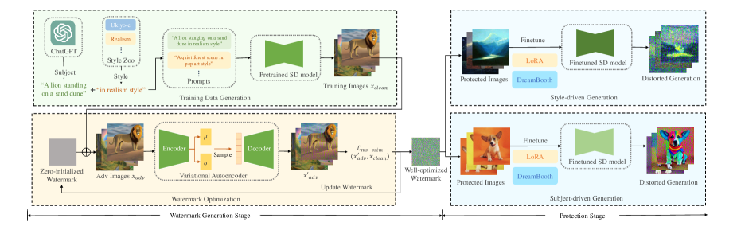

### 1. 論文摘要：

- **背景**：Stable Diffusion (SD) 模型在生成圖像方面具有高度靈活性，尤其是在個性化定制的情況下（如 DreamBooth 和 LoRA 方法），這可能導致侵犯版權的風險。
- **目標**：提出一種通用的對抗性水印（DUAW），該水印可以在不直接訪問版權圖像的情況下保護它們。這種水印不會影響圖像的可視性，但會干擾圖像生成模型，使生成的圖像出現明顯的失真。
- **方法**：DUAW 使用生成的合成數據進行訓練，而非版權圖像。通過對 SD 模型中的變分自編碼器（VAE）進行干擾，該水印能在廣泛的自定義圖像生成技術中產生失真。
- **結果**：實驗表明，該水印能有效破壞 SD 模型的自定義生成過程，使生成的圖像明顯失真並且可被簡單的分類器識別出來。

---

### 2. 主要貢獻：

1. **提出 DUAW**：這是首個無數據的通用對抗性水印，旨在保護受版權保護的圖像，防止其在定制的 SD 模型中被濫用。
2. **創新點**：通過干擾 VAE，使水印在不改變 SD 模型權重的情況下有效破壞圖像生成過程。
3. **無需訪問原始版權圖像**：通過生成合成數據，DUAW 可以在不直接處理版權圖像的情況下實現保護。
4. **實驗結果**：DUAW 可以在多個版本的 SD 模型中引入明顯的圖像失真，並成功地保護了圖像的版權。

---

### 3. 方法概述：

- **水印生成**：通過結合 ChatGPT 提供的內容提示和預訓練的 SD 模型生成合成訓練數據。然後，通過優化 MS-SSIM 損失來生成水印，該水印會在 SD 模型的生成過程中引入失真。
- **水印應用**：生成的 DUAW 水印會添加到需要保護的圖像中，當這些圖像被用於 DreamBooth 或 LoRA 進行自定義生成時，水印會導致生成的圖像出現明顯的失真。

---

### 4. 實驗結果：

1. **圖像相似度與質量**：通過 CLIP 分數和 IL-NIQE 量化 DUAW 的效果，結果表明該水印有效地降低了生成圖像與原始圖像的相似度，並且顯著降低了圖像的自然性。
2. **分類成功率**：使用簡單的分類器，DUAW 可以在大多數情況下成功識別出失真的圖像，表明其保護效果顯著。
3. **質量結果**：生成的水印能有效破壞自定義 SD 模型的輸出，並在不同的提示和自定義方法中穩定運行。
4. **轉移性**：DUAW 展現了良好的轉移性能，即使在不同版本的 SD 模型上，也能引入失真。

---

### 5. 結論：

DUAW 是一種無需數據的對抗性水印，能夠保護大量受版權保護的圖像，防止它們在不同版本的 SD 模型上被濫用。該水印主要通過干擾 VAE 來實現，並在多個版本的 SD 模型和自定義方法中展現出強大的保護效果。