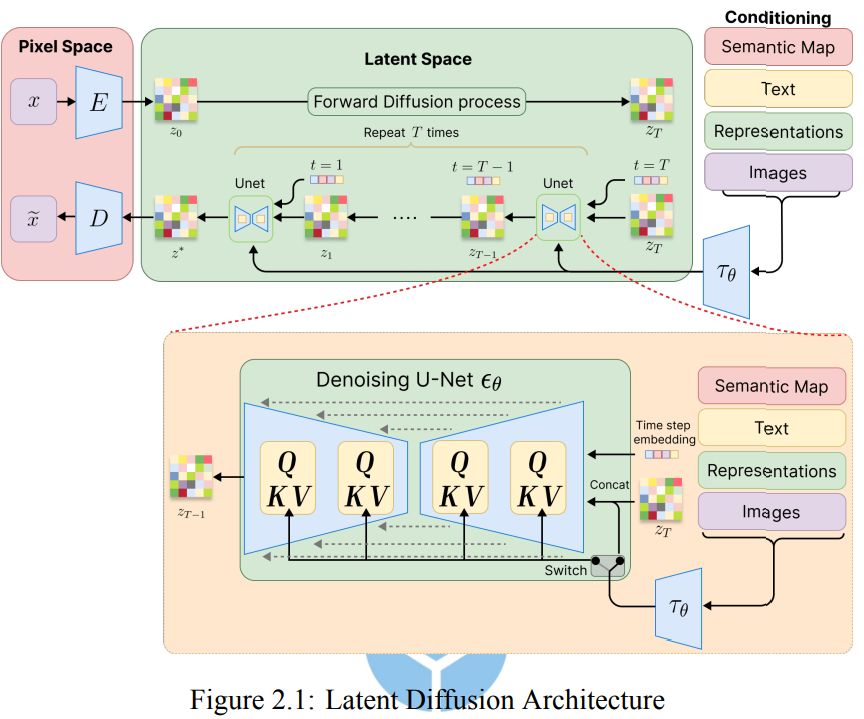

# 1. 引言

## 1.1 問題陳述

- **生成模型的發展與應用**：生成模型（如 Stable Diffusion）能夠根據用戶輸入生成高度逼真的圖像，並在多種應用中發揮重要作用，從數字藝術到現實場景生成。
- **版權問題**：Stable Diffusion 模型的訓練數據來自於抓取的網絡文本和圖像，這些數據經常包含未經藝術家授權的受版權保護材料，這引發了版權侵權的法律和倫理問題。
- **生成模型的記憶問題**：生成模型可能會記住訓練過程中的具體圖像，這使得生成的圖像可能與受版權保護的內容高度相似，甚至完全複製。
- **需要更新的監管措施**：現有的版權保護框架無法有效應對生成模型的濫用問題，並且模型的微調和適配能力進一步加劇了濫用的風險。
- **通用對抗性擾動（UAPs）**：該研究旨在開發一種新的方法，使用基於擴散過程損失和重建過程損失的混合技術，並結合動量技術來保護受版權保護的圖像，防止生成模型的未經授權使用。

## 1.2 研究目標與範圍

- **研究目標**：本研究旨在保護受版權保護的圖像，防止它們在生成模型的微調和部署中被未經授權使用。主要方法是使用對抗性範例來干擾生成過程，並保護圖像的獨特特徵。
- **通用對抗性擾動（UAPs）**：研究將探索如何利用單一擾動有效阻止生成模型準確重現多種受保護的圖像，進一步防止非法複製。
- **損失函數與生成技術**：研究將利用擴散過程和重建過程的損失函數來生成這些有效的通用對抗性擾動。
- **動量技術的應用**：研究將整合動量技術，以增強對抗性擾動的魯棒性和跨多次迭代的效果。
- **性能評估**：將使用如 FID、精度、CLIP 得分等評估指標，測試所提出方法在基準數據集和真實世界場景中的表現，並確保其有效性和普遍性。

## 1.3 文件組織

1. **引言**：提出了主要問題，即防止生成模型未經授權地使用受版權保護的圖像。
2. **文獻綜述**：介紹了 Stable Diffusion 和對抗性範例在生成模型中的作用，並討論了動量技術在提高生成模型效率和魯棒性方面的應用。
3. **提出的方法**：詳細描述了使用通用**對抗性擾動（UAPs）**保護版權圖像，並介紹了擴散和重建過程的損失函數如何與動量技術結合來增強擾動的有效性。
4. **實驗**：提供了對提出方法的實證評估，並討論了實驗結果、比較基準方法及不同參數對性能的影響。
5. **結論**：總結了研究發現，強調了通用對抗性擾動在保護版權圖像方面的有效性，並指出了擴散和重建過程及動量技術的作用。

---

# 2. 文獻回顧

## 2.1 Latent Diffusion Model

圖像 x 通過變分自編碼器（VAE）中的編碼器 ϵ 進行處理，編碼器將輸入映射到潛在空間中的分佈 z0。這個分佈通常以高斯分佈來建模，並具有學習得到的均值和標準差參數。

→ μ(x)和σ(x)是由神經網絡模型基於輸入x 學到的參數，而ϵ是從標準正態分佈N(0,I)中抽樣的隨機變量。

這樣的重參數化技巧確保了訓練過程中的梯度能夠順利流動，從而使得模型可以通過標準的反向傳播算法進行訓練。

→ 在潛在空間中，模型接著進行正向擴散過程，逐步將初始的潛在表示 z0 轉變為在T 個時間步長上變成高度噪聲化的版本zT。

→ 反向過程從純高斯噪聲 zt∼N(0,I)開始，並試圖通過逐步去噪來逆轉正向擴散過程，最終逐漸生成一個連貫的圖像。反向過程的目標是估算條件概率 pθ(zt−1∣zt)，其中 θ 是神經網絡的參數，該網絡在每個步驟預測噪聲組件。

→ 這個擴散過程損失函數有助於訓練模型在每個時間步準確預測噪聲，從而使反向過程能夠有效地去噪並生成高質量的圖像。

→ 將最終的去噪後的潛在表示 z0 轉換為具有高質量、真實感的圖像 $\tilde{x}$ ，從而完成整個生成過程。

(2.6) → 變分自編碼器（VAE）的目標是學習一個有意義且連續的潛在空間表示，用於輸入數據，從而實現原始數據的重建和新樣本的生成。為了達到這個目標，VAE 優化一個結合兩個主要組件的損失函數：重建損失和正則化損失。首先，重建損失用來衡量 VAE 如何從其潛在表示 z 中準確重建原始輸入數據 x，這促使模型在數據空間和潛在空間之間進行精確映射。重建損失通常使用均方誤差（MSE）等指標來衡量。

(2.7) → 正則化損失（KL 散度）。這一項促使潛在空間的分佈 q(z∣x) 逼近標準高斯分佈 p(z)=N(0,I)。這種正則化有助於保持潛在空間的連續性和平滑性，使得 VAE 能夠從這個高斯分佈中進行採樣，生成多樣化但真實的樣本。

(2.8) → combine

## 2.2 Adversarial Attack

**對抗樣本**：

- 對抗樣本是經過故意擾動的輸入，這些擾動能夠使得機器學習模型做出錯誤的預測，這些擾動對人類可能是不可察覺的，但會對模型造成嚴重影響。
1. **攻擊類型**：
    - **投毒攻擊**：在訓練過程中注入惡意數據，影響模型的學習過程。
    - **逃避攻擊**：在測試階段進行，通過對測試數據進行微小擾動來誤導模型。
    - **黑箱攻擊**：攻擊者對模型的內部結構一無所知。
    - **白箱攻擊**：攻擊者完全了解模型的內部參數。
    - **定向攻擊**：使模型將輸入誤分類為特定的類別。
    - **非定向攻擊**：僅使模型對輸入進行錯誤分類。
2. **對抗擾動的類型**：
    - **簡單擾動**：針對單一輸入進行改動。
    - **通用擾動（UAPs）**：設計來對多個輸入產生效果，能夠有效誤導模型。
3. **對抗攻擊的三大方法**：
    - **一步梯度方法**（如 FGSM）：基於梯度快速生成對抗樣本。
    - **迭代方法**（如 PGD）：通過多次步驟精煉對抗樣本，逐步增強對模型的攻擊效果。
    - **優化方法**（如 C&W）：通過優化問題來生成最小的對抗擾動。
4. **本研究的方法**：
    - 使用 **白箱攻擊**，並利用 **通用對抗擾動（UAPs）** 進行 **非定向攻擊**。
    - 採用 **投影梯度下降（PGD）** 方法，這使得能夠在隨機擴散過程中對擾動進行有效的迭代優化，對於擴散模型（如 Stable Diffusion）特別適用。

## 2.3 Adversarial Example on Generative Model

1. **對抗樣本的應用**：
- **AdvDM算法**：這種方法使用擴散過程來創建對抗樣本，能夠有效阻止生成模型對原始藝術作品的複製，通過“擴散過程損失”來使生成的圖像看起來與原始作品相似但無法精確重建。
1. **DUAW方法**：
    - 利用VAE的重建損失生成UAPs，這些UAPs像水印一樣嵌入到圖像中，無法被人眼察覺，但會在生成過程中引起顯著的扭曲，有效防止未經授權的圖像模仿。
2. **UAPs的優勢**：
    - UAPs能夠跨多個輸入工作，這使它們成為強大的防護工具，無論對輸入數據或條件如何，它們都能削弱生成圖像的質量。
3. **生成模型的防護需求**：
    - 隨著對抗樣本技術的發展，生成模型需要更強的防禦策略來防止未經授權的創作，尤其是在模型的擴散過程和VAE重建過程中發現的弱點。
4. **本研究方法**：
    - 研究結合了擴散過程和VAE重建過程，旨在創建對抗樣本，不僅能夠使生成圖像偏離預期範圍，還能在重建過程中使模型生成扭曲的輸出。

## 2.4 Booting the effectiveness of adversarial example by using a momentum

1. **動量在對抗攻擊中的作用**：
    - 動量有助於穩定和加速對抗攻擊的過程，通過引入過去梯度的累積，使每次更新都更加穩定，並防止擾動振蕩，從而提高攻擊的有效性。
2. **提升對抗攻擊的有效性**：
    - 動量使得對抗擾動在多次迭代中變得更加集中和精確，這樣可以有效地對抗深度學習模型，減少模型對這些擾動的反擊。
3. **提高轉移性**：
    - 動量還可以提升對抗攻擊的轉移性，使得在一個模型上生成的對抗樣本能夠成功欺騙其他模型，這對於實際應用中的安全性防護至關重要。
4. **應用於本研究**：
    - 本研究將動量應用於生成對抗樣本的過程，通過記住過去的梯度方向，能夠生成更具針對性和效果的擾動，這有助於攻擊模型並使其更難以抵禦。

---

# 3. 提出的方法

## 3.1 基本概念

對抗範例

- AdvDM
- DUAW

→ 基於 AdvDM 和 DUAW 等方法的基礎，我們提出了一種混合的對抗方法，結合了擴散模型和重建模型的優勢，來創建有效的通用對抗擾動（UAP）。

A: 受 AdvDM 方法的啟發，我們對傳統的擴散過程進行了修改，僅在特定的隨機選擇的時間步長 t 上加入噪聲，而非在所有時間步長上都進行噪聲擴散。這意味著我們只在某個特定的時間步長 t 上將噪聲添加到潛在表示中，並將帶有噪聲的圖像用於反向擴散過程，其中 U-Net 模型會嘗試預測並移除該時間步長 t 上的噪聲。

B: 將帶擾動的圖像轉換為壓縮的表示形式，該表示形式能夠捕捉圖像的基本特徵，同時保留最初的對抗擾動。這個過程的關鍵在於將圖像轉換為潛在空間的表示，使得對抗擾動能夠在這一過程中被有效地嵌入和保留。這樣，圖像在經過擴散模型的進一步處理後，對抗擾動將能夠持續影響生成結果，從而實現對模型生成能力的干擾。

C: 將傳統的前向擴散過程（2.2）進行調整(3.3)，在每次迭代中，我們隨機選擇一個時間步長 t，並將噪聲添加到已經包含初始擾動的潛在圖像中。這一調整會在特定的時間步長上生成帶有噪聲的潛在表示，從而使模型在不同的迭代中經歷不同強度的噪聲。這種方法通過在特定時間步長引入噪聲，避免了傳統擴散過程中噪聲的均勻加劇，並使得每次擾動的強度都能有所變化，進而增加模型在學習過程中的挑戰，強化對抗效果。

D: 在圖像被編碼到潛在空間之前，我們就已經將通用對抗擾動添加到圖像中。這樣做使得 U-Net 在反向過程中難以準確預測噪聲。我們的目標是最大化實際噪聲與預測噪聲之間的差異，從而使得模型在訓練過程中難以從對抗圖像中學習。

E: 進入重建階段，這一階段的設計受 DUAW 方法的啟發。在這一階段，我們使用變分自編碼器（VAE）將帶噪的潛在表示解碼回像素空間。這裡的主要目標並非生成一個忠實的重建圖像，而是評估重建圖像與原始圖像之間的差異。

F: 為了量化這一差異，我們使用了多尺度結構相似性指數（MS-SSIM）來作為重建損失。MS-SSIM 能夠有效捕捉圖像之間的結構性與感知性差異，因此特別適合用來評估對抗影響。

G: 我們將重建損失與擴散過程中的損失結合，指導對抗擾動的生成。這一結合確保了對抗影響在擴散與重建過程中得以加強，從而為生成通用對抗擾動（UAP）提供了一個強有力的機制。這樣，我們可以防止模型準確捕捉並重建原始的、受版權保護的內容，從而有效保護其免受未經授權的複製。

H: 為了進一步提升 UAP 的效果，我們在梯度更新過程中引入了動量優化。動量在創建通用擾動中起著關鍵作用，因為它可以累積先前迭代的梯度，確保擾動更新在不同圖像間保持一致性並具有持久影響。通過累積這些梯度，動量有助於穩定優化過程，使得擾動能夠在各種輸入圖像中都有效。

I: 為了進一步完善 UAP，我們採用了投影梯度下降（PGD）。PGD 根據損失函數的梯度迭代調整對抗擾動，並將其投影回有效的擾動空間，確保變動保持細微且不可察覺，同時對多張圖像都有效。這一迭代過程對於確保生成的 UAP 既能保持對抗效力，又不影響圖像的視覺質量，至關重要。

J: 通過結合擴散、重建、動量優化和 PGD，我們提出的方法能夠生成在多樣化輸入圖像上都有效且視覺一致的通用對抗擾動（UAP）。擴散和重建過程將對抗噪聲引入並精煉，保證其普適性；動量優化幫助穩定梯度更新，保證擾動在不同圖像中的有效性；而 PGD 則進一步精煉擾動，保持其感知上的細微性。

→ 這些技術的結合使得生成的 UAP 能夠成功削弱生成模型對受版權保護內容的復制能力，從而提供一個強大且通用的對抗解決方案。

## 3.2 威脅模型

- Threat model → LoRA, DreamBooth
- Victims → artists, photographers…

## 3.3 提出的框架

### 3.3.1 擾動生成於擴散過程

1. Initial Perturbation: (A)
    
    每次生成過程的初期，對每張選定的圖像施加擾動，這些擾動將影響後續的生成過程。
    

1. Latent Space Encoding: (B) 
    
    將帶擾動的圖像轉換為壓縮的表示形式，能夠捕捉圖像的基本特徵，同時保留最初的對抗擾動。
    

1. Applying Noise to Latent Image: (C)
    
    通過在特定時間步長引入噪聲，避免了傳統擴散過程中噪聲的均勻加劇，並使得每次擾動的強度都能有所變化，進而增加模型在學習過程中的挑戰，強化對抗效果。
    
    
    
2. U-Net Noise Prediction and Loss Calculation: (D)
    
    我們計算預測噪聲與實際噪聲之間的均方誤差，並將其定義為傳統的擴散過程損失(2.4)。這個誤差隨後用於指導生成更有效的對抗性擾動(3.4)。
    
    
    

### 3.3.2 擾動生成於重建過程

→ 通過利用 MS-SSIM 作為損失函數，並結合擴散過程的損失，我們的方法成功在結構性和感知層面引入對抗性擾動。這些擾動不僅對生成模型的性能造成顯著干擾，還能在保持不可察覺性的同時，對廣泛輸入具有通用性。

1. . Latent Image Decoding: (E)
    
    我們將已經加入噪聲的擾動潛在圖像 z′ (3.2) 通過VAE的解碼器進行處理，從而生成圖像的重建版本。此步驟將帶有噪聲的潛在空間表示轉換回像素空間。
    
2. Calculating the Reconstruction Loss Using MS-SSIM metric: (F)
    
    通過利用MS-SSIM，我們確保對抗性擾動會顯著削弱模型準確重建輸入圖像的能力，有效阻礙模型學習原始特徵。
    
    1 表示完全相似，0 表示完全不相似。如果直接使用 MS-SSIM 作為損失，其最大化過程會促進重建圖像與原始圖像的更高相似性，這與對抗訓練的目標相矛盾。
    
    所以 3.5 才改成 1-MS-SSIM。
    
    在此形式下，損失值越高，原始圖像與重建圖像之間的感知差異越大。
    
    
    
    
    

### 3.3.3 結合損失並利用動量增強

- 在傳統優化中 → **動量** 是一種加速收斂的技術，它通過累積先前步驟的梯度來促進優化進程。這樣的累積有助於平滑更新路徑，並能避免優化過程中陷入局部最小值。特別是在高維優化空間中，動量可以穩定更新，促使優化器朝著正確的方向收斂。
- 在對抗性攻擊中 → 使用動量項來生成針對分類模型的對抗性範例。這些方法通過在多次迭代中累積梯度，穩定更新方向，避免陷入不良的局部最大值，從而提高對抗性範例的成功率，並在白盒和黑盒模型中達到更高的可轉移性。
- 在我們的方法中 → 我們通過**累積來自兩個過程的綜合損失的梯度**，並集成動量項來提升更新的穩定性和擾動的持續性。這樣，擾動能夠在每次更新中穩步增強，達到更強大且更具韌性的對抗效果。
- 在計算過程中 → 我們將梯度積累的過程與動量優化結合，確保擾動在每次更新時能穩定增長。這不僅有助於提高對抗性範例的有效性，還能使得這些擾動在生成過程中更具韌性，即使面對不同類型的生成模型或多樣化的輸入圖像，也能保持有效性。
1. Loss Combination: (G)
    
    結合擴散損失（L_diffusion）和重建損失（L_reconstruction）的目的是為了讓對抗性擾動在兩個階段都能起到有效的干擾作用。為此，我們將兩個損失進行加權組合，這樣能夠在擴散過程和重建過程中保持平衡影響。
    
    
    
    其中，γ 和 λ 是加權係數。這些係數控制每個損失對最終結果的影響。
    
    在計算完組合損失後，我們需要計算損失函數的梯度，這將用來優化對抗性擾動。
    
    
    
    這樣的梯度計算會將兩個損失的影響都考慮在內，並指導模型在擴散和重建過程中生成對抗性擾動。
    
2. Incorporation of Momentum: (H)
    
    將動量納入來自組合損失的梯度進一步增強了優化過程，通過攜帶先前迭代的梯度信息來實現。這一動量技術使得對抗性擾動可以在多個步驟中積累並保持一致的方向性。因此，生成的對抗範例變得更加健壯，因為它同時利用了擴散過程和重建過程，並通過動量保持一致且增強的攻擊方向。
    
    
    
    
    

### 3.3.4 通用對抗擾動與投影梯度下降

→ UAP的優勢在於它們能創建單一的擾動，該擾動能在多張圖像上有效地降低模型性能，這使得它們在大規模對抗攻擊中極具威脅。

→ 目標是找到能破壞幾乎所有圖像的擾動向量 δ，這些圖像在經過擾動後，會對擴散過程和重建過程產生影響。

→ 為了優化通用對抗擾動 δ，我們使用**投影梯度下降法**（PGD），這是一種常見的對抗攻擊方法，用於優化擾動，同時將其保持在定義的約束範圍內。PGD 通過不斷細化對抗擾動，每次更新後將其投影回有效範圍內，從而確保擾動保持微妙且符合約束。這種方法在對抗攻擊中尤其有效，因為它允許對擾動進行受控的步進調整，保持擾動在設定的限度內，既不過於明顯，又能有效干擾模型的生成能力。

→ 在**投影梯度下降法**（PGD）中，通過迭代調整通用對抗擾動δ，使其越來越能“迷惑”模型。這是通過調整δ，使其朝著最大化特定損失函數（擴散過程損失和重建損失）方向進行，從而使得輸入圖像對模型來說越來越難以準確解讀。

→ 在每次PGD迭代中，δ根據損失函數的梯度方向和動量（3.8）微調更新，這樣可以使擾動更具針對性和效果。最終的更新公式如3.10。

## 3.4 Algorithm

1. **隨機初始化擾動 δ₀，確保其範數 ||δ||ₚ 不超過 ξ。**
    - 在這一步，擾動 δ₀ 被隨機初始化，並且保證它的範數不超過給定的擾動預算 ξ。
2. **外層迴圈執行 N 次，用於逐步優化通用對抗擾動。**
    - 外層迴圈控制演算法的總迭代次數，每次迭代會對擾動進行更新。
3. **初始化動量 M 為零，用於加速梯度更新過程。**
    - 動量 M 被初始化為零，並用來累積過去的梯度信息，加速收斂過程。
4. **遍歷影像集合 X 中的每張影像 xᵢ。**
    - 在每次外層迴圈的迭代中，對影像集合 X 中的每一張影像進行處理。
5. **對每張影像 xᵢ，加入擾動 δ 生成擾動影像 xᵢ'。**
    - 將初始擾動 δ 加到每張影像 xᵢ 上，生成新的擾動影像 xᵢ'。
6. **將擾動影像 xᵢ' 經由編碼器 ε，得到潛在表示 zᵢ'。**
    - 使用編碼器 ε 將擾動影像 xᵢ' 映射到其潛在表示 zᵢ'。
7. **隨機從範圍 [1, T] 中抽樣一個時間步驟 t。**
    - 隨機選擇一個時間步驟 t，這個步驟在潛在擴散過程中扮演重要角色。
8. **基於時間步驟 t 計算噪聲潛在變量 zᵢ,t'。**
    - 根據隨機選擇的時間步驟 t，計算噪聲潛在變量 zᵢ,t'，以便在擴散過程中引入噪聲。
9. **計算潛在擴散模型 (LDM) 損失。**
    - 計算 LDM 損失，這是基於原始噪聲和潛在變量之間的差異。
10. **計算多尺度結構相似性 (MS-SSIM) 損失。**
    - 計算 MS-SSIM 損失，通過衡量原始影像和重構影像之間的相似度來控制視覺質量。
11. **根據總損失的梯度更新擾動。**
    - 根據總損失函數的梯度，更新擾動 δ，目的是最小化損失。
12. **更新動量 M，結合歷史梯度與當前梯度。**
    - 根據歷史梯度和當前梯度的加權組合來更新動量 M。
13. **使用 L2 正規化對梯度進行標準化。**
    - 使用 L2 正規化將梯度進行標準化，確保梯度的幅度不會過大或過小。
14. **基於步長和梯度方向更新擾動 δ。**
    - 根據步長 α 和梯度方向，更新擾動 δ，以減少損失。
15. **將更新後的擾動限制在允許的範圍內。**
    - 確保更新後的擾動 δ 仍然在範圍 [-ξ, ξ] 內，避免超出預設的擾動限制。
16. *返回最終的通用對抗擾動 δ。*
    - 最終返回通用對抗擾動 δ*，這是經過多次迭代更新後的最終結果。

---

# 4. 實驗

## 4.1 硬體與軟體規格

- torch 版本 2.1.2
- CUDA 11.8
- NVIDIA GeForce RTX 3080 GPU
- 第 12 代 Intel i7-12700 CPU（2.10 GHz）
- 32 GB RAM

## 4.2 數據集

1. **Dreambooth 數據集**：Dreambooth 數據集包含來自 15 個不同類別的 30 個主題。其中，9 個主題是活體動物（包括狗和貓），其餘 21 個是無生命物體。每個主題由不同數量的圖像組成，範圍從 4 張到 6 張不等。這些圖像在不同的條件、環境和角度下拍攝，為每個主題提供了多角度、全方位的視覺資料。
2. **Wiki-art 數據集**：Wiki-art 數據集包含來自 WikiArt.org 的 81,444 件視覺藝術作品，涵蓋了來自不同藝術家的作品。每張圖像都標註了藝術家、藝術流派和風格等類別標籤，這使得對視覺藝術在多維度上的綜合分析成為可能。

## 4.3 評估指標

### 4.3.1 Frechet Inception Distance (FID)

### 4.3.2 精確度 (Precision)

### 4.3.3 對比語言-圖像預訓練 (CLIP) 分數

### 4.3.4 完全盲目的圖像質量評估 (IL-NIQE)

### 4.3.5 The Classifier Success Rate(SR)

## 4.4 衰減因子的分析µ

## 4.5 迭代次數分析

## 4.6 擾動大小的分析

## 4.7 結合與非結合損失方法的結果比較

## 4.8 基準模型比較

## 4.9 生成對抗範例的時間比較

## 4.10 不同方法的對抗範例可轉移性比較

## 4.11 不同方法的對抗防禦比較

## 4.12 不同方法的 GPU 記憶體消耗比較

---

# 5. 結論

- **新穎的方法**：
    - 結合了擴散過程和重建過程，旨在生成強健的對抗擾動，阻止生成模型正確學習版權圖像的特徵。
- **實驗結果**：
    - 使用多種指標（FID、精度、CLIP 分數等）進行評估，顯示所提出的方法相較於其他方法有顯著優勢。
- **資源消耗**：
    - 該方法相較於其他方法需要更多的計算資源，尤其是 GPU 記憶體和時間，這是其效果增強的代價。
- **折衷問題**：
    - 儘管該方法提供更高的效能和保護，但其資源需求可能影響其在大規模應用中的效率，因此需要在效果與效率之間進行權衡。