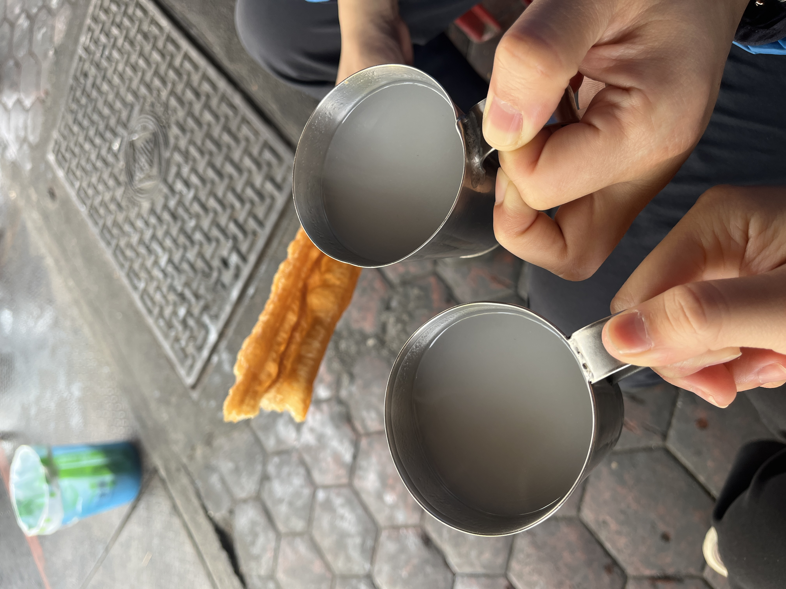
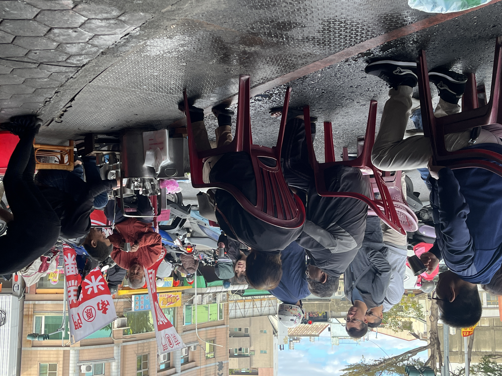
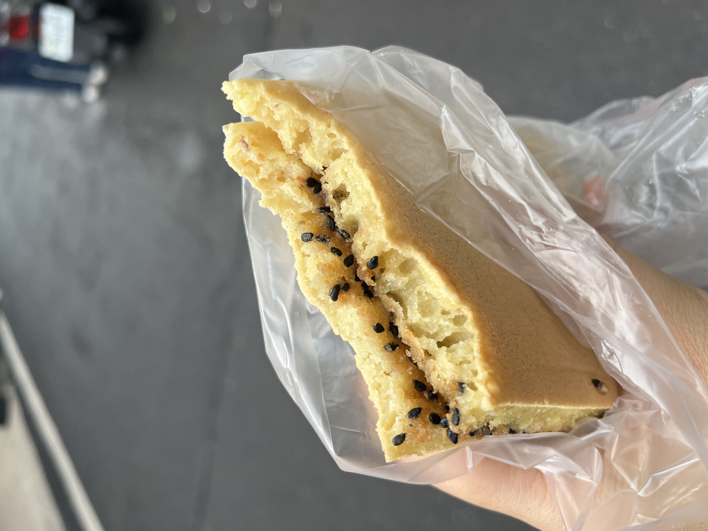
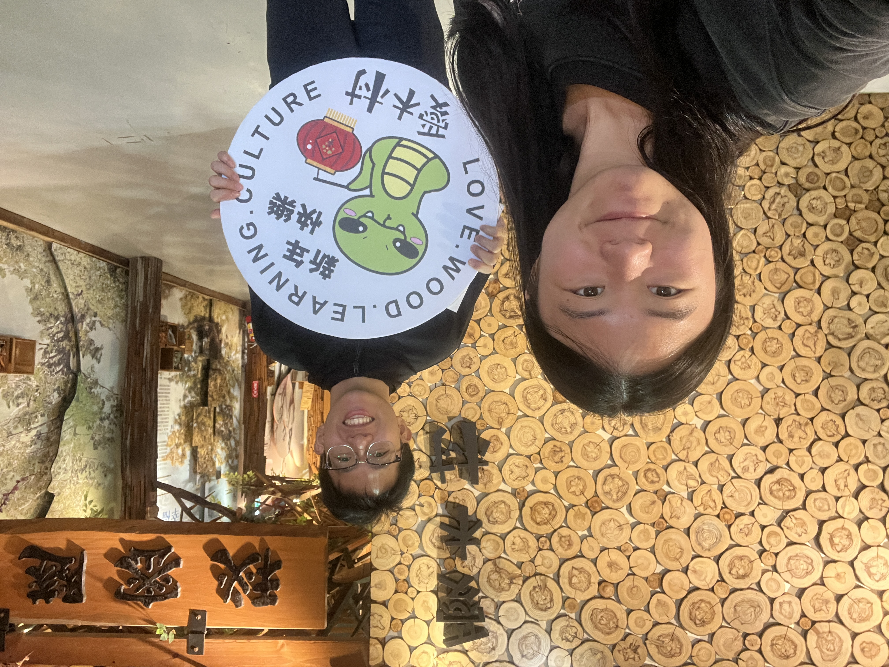
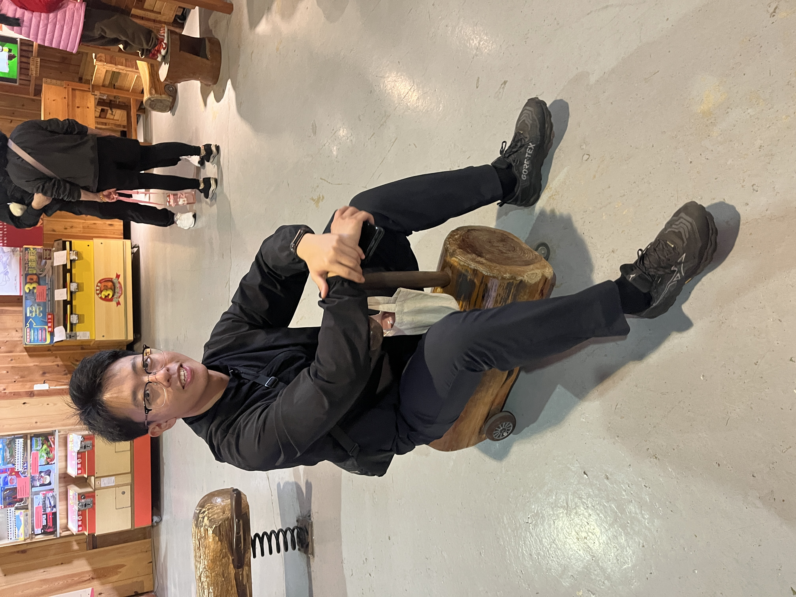
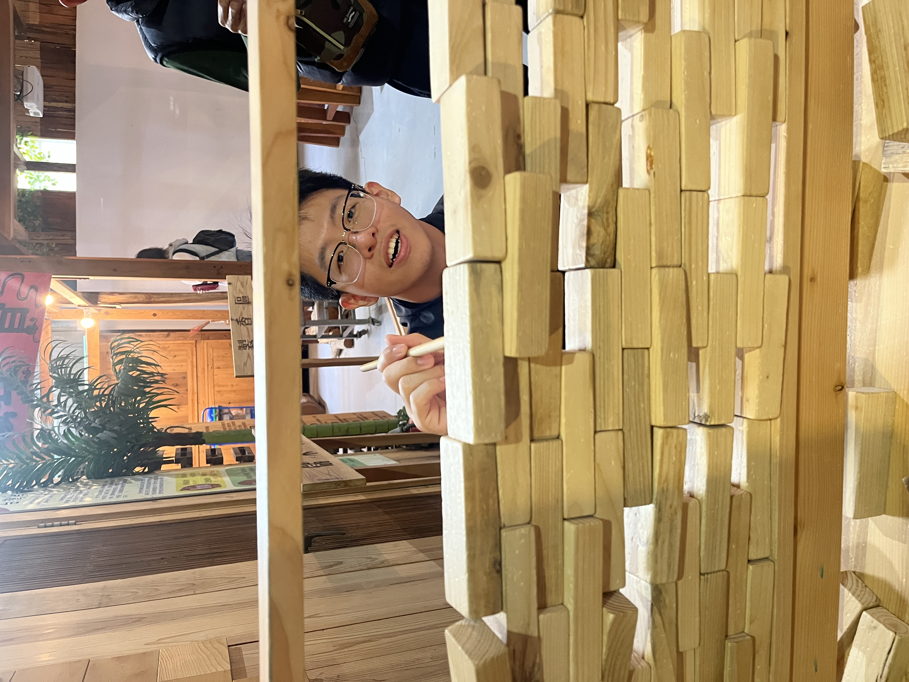
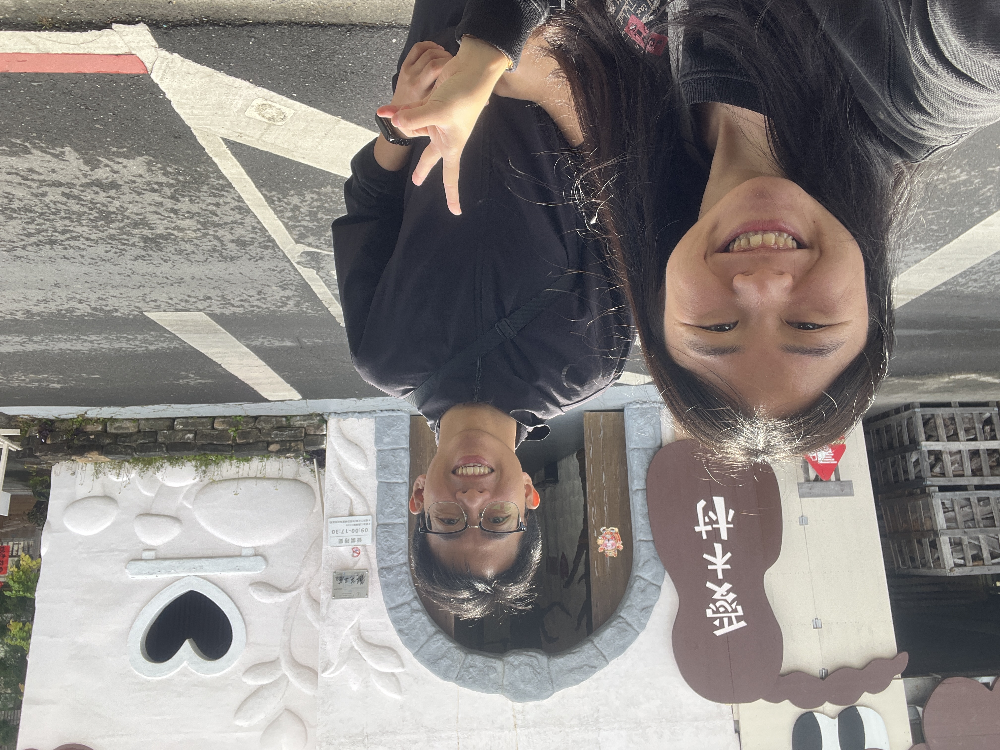
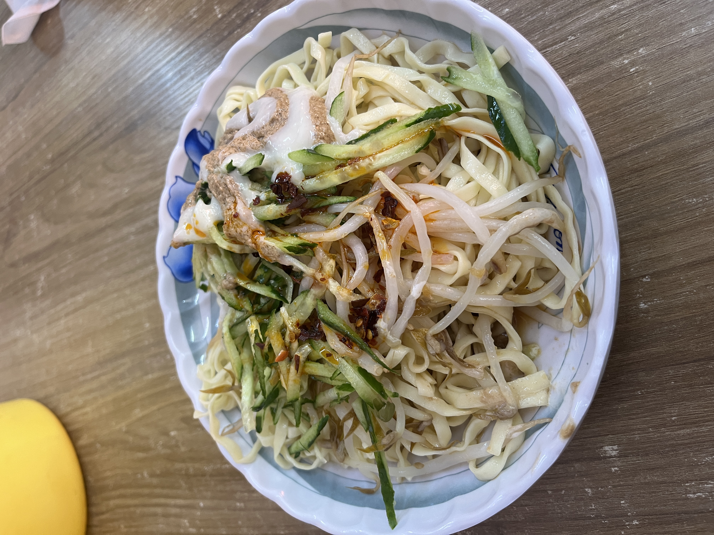
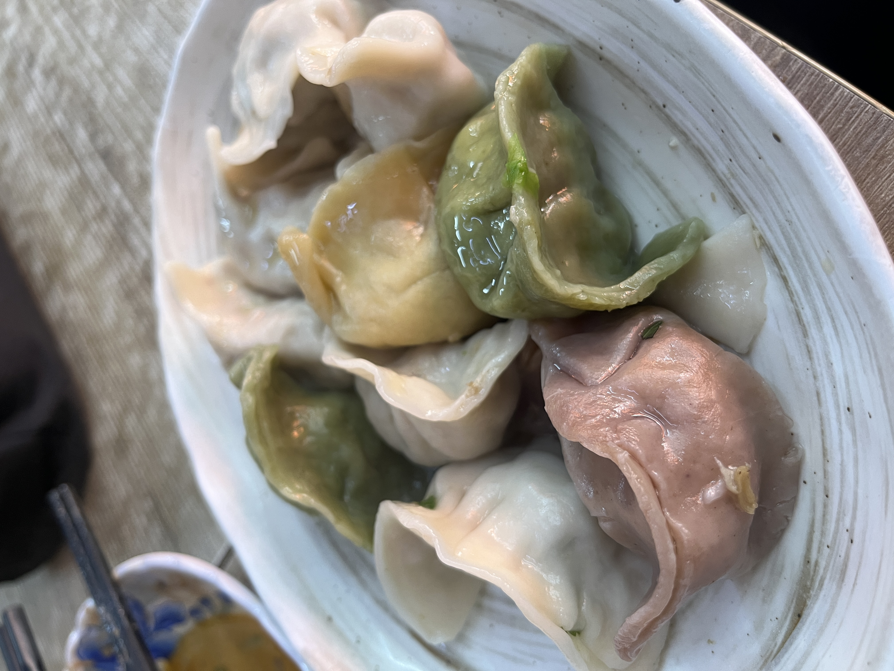

## Day 1 - 嘉義市區美食與文化之旅

### 早餐 - 南門包氏炭燒杏仁茶
位於嘉義市區的老字號店家，只販售杏仁茶和油條的簡單組合。香濃的杏仁茶搭配酥脆的油條，是最傳統的台式早餐。在寒冷的早晨喝上一碗溫暖的杏仁茶，整個人都暖和了起來。

### 上午點心 - 傳統麥仔餅
在市場裡尋得的傳統小點心，外皮酥脆，內餡香甜，充滿懷舊的好味道。麥仔餅是台灣傳統糕餅，每一口都能感受到古早味的純樸。

### 愛木村木藝體驗
在這裡重溫童年回憶，體驗各式木製童玩。從陀螺、彈珠台到木製益智遊戲，每個玩具都充滿溫潤的木質觸感，讓人感受到傳統工藝的魅力。木頭特有的質地和香氣，讓整個空間充滿療癒感。
 
 
 

### 午餐美食巡禮
- **二丫頭麻辣涼麵**：點了招牌麻辣涼麵和水餃，麻辣的層次豐富，麵條Q彈有勁道。
 

- **民主火雞肉飯**：油亮的雞肉搭配特製醬汁，香氣四溢，讓人一口接一口。

- **林聰明沙鍋魚頭**：湯頭濃郁鮮美，魚肉鮮嫩，是嘉義必吃的經典美食。

### 下午茶 - 源興御香屋
雖然排隊人潮洶湧，但特製的香橙百香綠茶真的值得等待。清新的柑橘香氣配上酸甜的百香果，一解午後的悶熱。

### 傍晚 - 檜意生活村散策
騎著單車漫遊在充滿日式風情的老屋之間，彷彿穿越時空。這裡保留了許多舊建築，但注入了新的生命力，各式文創小店和咖啡廳讓空間更添活力。氛圍和台中審計新村相似，但更有嘉義特色。

### 晚餐 - 蒜頭美食之旅
- **台北深坑脆皮臭豆腐**：外酥內嫩，搭配特製醬料，香氣四溢。
- **木精霊傳統豆花**：古早味的豆花，綿密滑順，搭配香甜的粉圓，是完美的飯後甜點。

### 住宿 - 長榮文苑酒店
舒適的環境讓疲憊的身心得到充分休息，為明天的行程養精蓄銳。

## Day 2 - 休閒與文化的完美演繹

### 早餐
酒店提供的自助早餐種類豐富，從中西式到在地特色美食一應俱全，讓人精神飽滿地開始新的一天。

### 咩咩上樹萌寵樂園
雖然動物種類不如預期豐富，但還是能與可愛的動物們近距離互動，適合帶小朋友同行。建議可以事先查詢當日的動物互動時間，獲得更好的體驗。

### 國立故宮博物院南部院區
欣賞珍貴的文物展覽，體驗亞洲藝術文化的精髓。南院以亞洲藝術文化為主題，展現出與北院不同的特色。現代化的建築設計本身就是一件藝術品，值得細細品味。

### 午餐 - 麥當勞
在返程前，簡單享用了一頓快餐，為這次豐富的嘉義之旅畫下句點。

## 旅行心得
短短兩天的嘉義之旅，體驗了在地特色美食、文化景點和休閒娛樂，雖然行程緊湊但收穫滿滿。嘉義不只有美食，更有豐富的人文風情等待探索。建議下次可以多預留一些時間，細細品味這座城市的魅力。