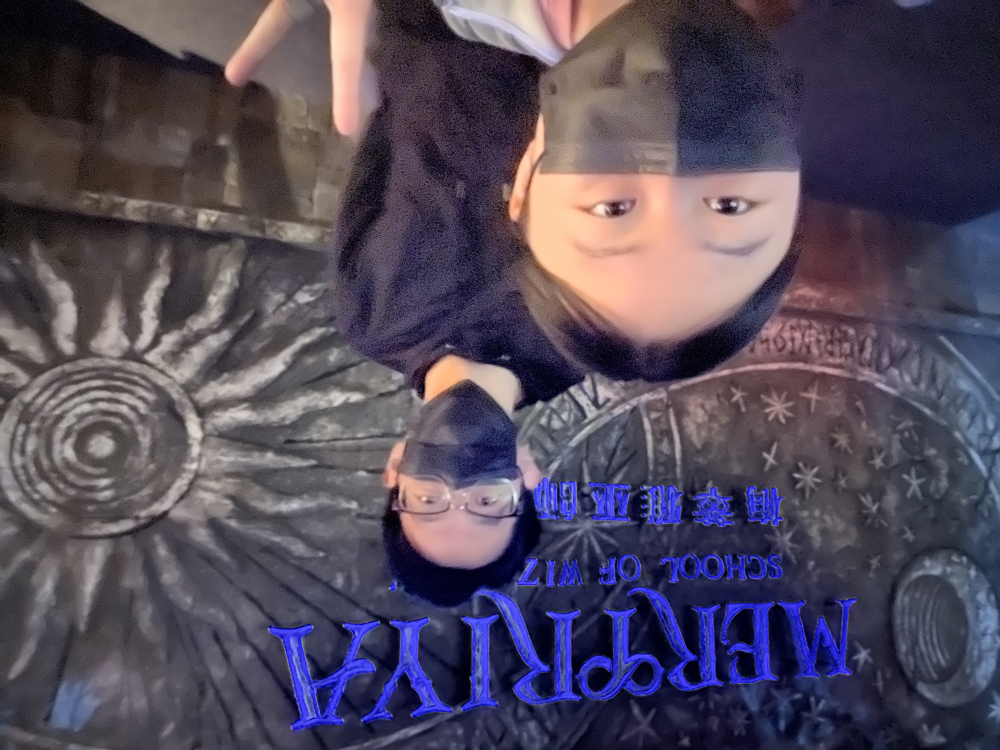
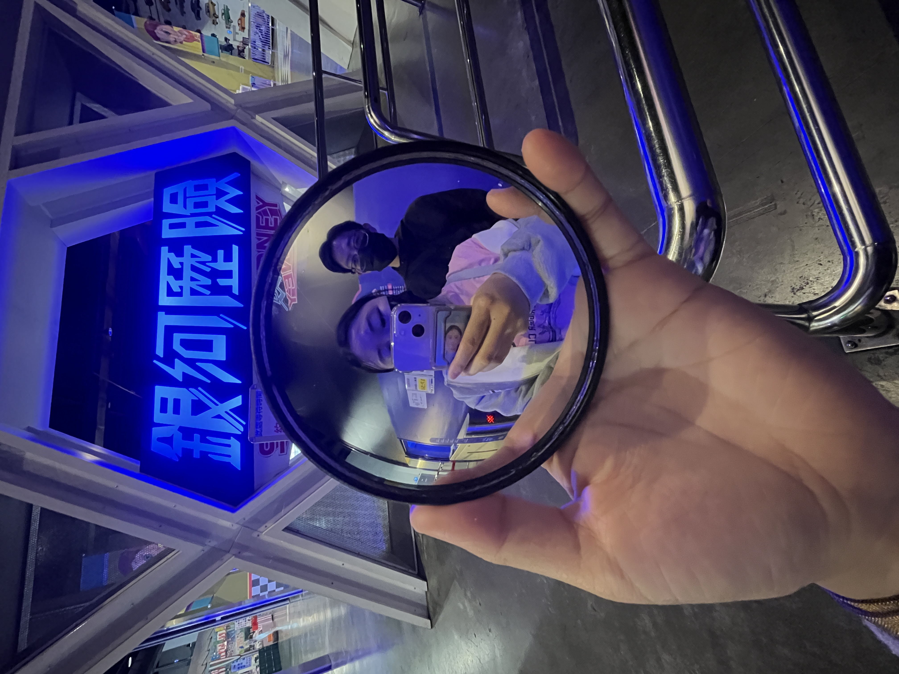
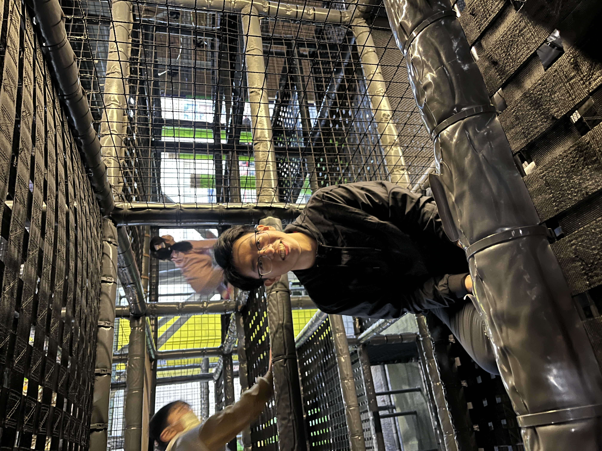

## ✏️ 2/14 情人節晚餐
📍 橄欖樹廚房

情人節當晚，我們選擇了交大附近的橄欖樹廚房用餐。
這家餐廳走的是溫馨路線，燈光柔和，氣氛還算浪漫，但價格偏高。
油煙味稍微重了些，可能是開放式廚房的關係，吃完衣服上都帶著點味道。
食物本身不難吃，份量適中，味道也算得上用心，但整體來說不算特別驚艷，頂多是中規中矩。

    

        
        
套餐

    

    

        
        
情人節晚餐

    

    
    
情人節晚餐

## ✏️ 2/15 尚順育樂中心
隔天，我們終於用上了半年前買的尚順遊樂園門票！一到園區就感覺很放鬆，因為人潮不多，不用排長隊，逛起來特別舒服。設施都很新穎且維護得很好，感覺比一些老牌遊樂園用心。不過大部分遊樂項目都搭配3D影片，還要戴3D眼鏡，看久了真的很容易頭暈，尤其是連續玩了幾個之後，眼睛和腦袋都有點負荷過重。
即便如此，整體體驗還是讓人滿意，值得一遊。

我們還額外花錢體驗了“飛越中國”的4D影片，原本期待很高，因為宣傳聽起來很震撼。實際看完覺得還不錯，畫面很美，飛越各地的視角也很新奇，但一樣有3D暈的問題。如果能在影片中加入一些文字介紹，比如每個地點的名稱、歷史或文化背景，應該會更有深度，讓人印象更深刻。

（P.S.這裡的停車費有點貴，下次決定直接停旁邊的大潤發，省錢又方便！）

    

        
        
比賽誰射的分數高

    

    

        
        
玩3D遊樂設施

    

    

        
        
逛了用心設計的魔法城鎮

    

    

        
        
電梯隨手拍

    

    

        
        
拿了新的凸面鏡亂拍

    

    

        
        
真的很不會拍...
        

    

    

        
        
旋轉木馬！

    

    

        
        
飛越中國～

    

### 走平衡木
接著挑戰了平衡木，這真的是超級難但又超級好玩！繩子雖然有點髒，但完全不影響樂趣。
整個過程很刺激，有挑戰性，也很有成就感。

    

        
        
平衡木起點

    

    

        
        
一堆路線

    

    

        
        
豬豬亂走

    

    

        
        
快樂合照

    

### 攀岩
攀岩體驗有點驚險刺激！
一開始信心滿滿，但爬到一半高度時開始覺得有點可怕，手臂也超酸，完全是體力與意志力的雙重考驗。
到頂時我實在不敢直接跳下來，只能慢慢下去。
不過設施很專業，安全...吧？

    
    
攀岩牆隨手拍

### 跟小孩搶遊樂場
園內還有個小型遊樂場，有溜滑梯、小攀爬區，還有一堆球可以丟來丟去，專為小孩設計的，但當然要去玩吧？！
環境乾淨，設施比劍湖山的新很多。

    

        
        
小屁孩豬肥

    

    

        
        
球池大戰

    

### 尚順旁邊的購物中心
中午在旁邊的購物中心美食街隨手買了午餐。
吃飽後還可以逛商店，氣氛輕鬆，很適合休息一下再繼續玩。

    

        
        
我吃了韓式豆腐鍋

    

    

        
        
隨手拍

    

### 晚餐吃起家雞！
晚餐選了起家雞，可惜新竹這家只有外帶，沒能坐下來好好吃，但帶回家吃還是很滿足，完美結束這趟情人節小旅行！

    
    
起家雞外帶晚餐

